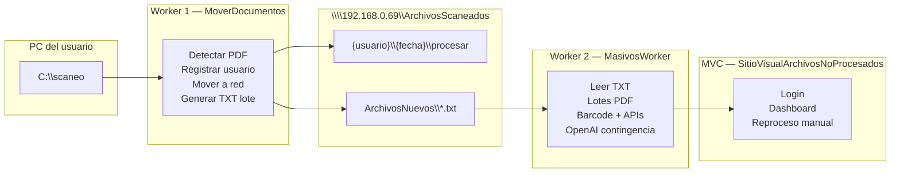

# Manual de Usuario y Especificación — Sistema de Escaneo, Procesamiento y Consulta de Documentos

| Campo | Valor |
|-------|-------|
| **Versión del manual** | 3.0 |
| **Fecha** | 2026-06-02 |
| **Audiencia** | Usuarios operativos, administradores e implementadores |

---

## Índice

1. [Resumen del sistema](#1-resumen-del-sistema)
2. [Mapa de proyectos en el repositorio](#2-mapa-de-proyectos-en-el-repositorio)
3. [APIs y endpoints (proyecto MasivosWorker)](#3-apis-y-endpoints-proyecto-masivosworker)
4. [Estructura de almacenamiento compartido](#4-estructura-de-almacenamiento-compartido)
5. [Worker 1 — Recepción y organización de escaneos](#5-worker-1--recepción-y-organización-de-escaneos)
6. [Worker 2 — Procesamiento de documentos](#6-worker-2--procesamiento-de-documentos)
7. [Aplicación Web MVC — Consulta y reproceso manual](#7-aplicación-web-mvc--consulta-y-reproceso-manual)
8. [Guía operativa para el usuario final](#8-guía-operativa-para-el-usuario-final)
9. [Estado de implementación](#9-estado-de-implementación)
10. [Control de versiones del manual](#10-control-de-versiones-del-manual)

---

## 1. Resumen del sistema

El sistema requiere **tres aplicaciones independientes**, integradas entre sí:

| # | Aplicación | Rol | Carpeta del proyecto |
|---|------------|-----|----------------------|
| 1 | **Worker 1** — Servicio Windows | Detecta PDF escaneados en el PC del usuario (`C:\scaneo`), los organiza en la unidad compartida por usuario y fecha, y genera archivos de lote (TXT). | `MoverDocumentos/` *(por crear)* |
| 2 | **Worker 2** — Servicio Windows | Procesa documentos: lector de código de barras (IronBarcode), consumo de APIs Helpharma y OpenAI como contingencia. | `MasivosWorker/` *(implementado)* |
| 3 | **Portal Web MVC** — .NET 10 | Consulta y reproceso manual de documentos no procesados. | `SitioVisualArchivosNoProcesados/` *(por crear)* |

El sistema debe operar de forma automática, robusta y tolerante a fallos, con trazabilidad por **usuario** y **fecha de escaneo** (`YYYY-MM-DD`).



---

## 2. Mapa de proyectos en el repositorio

Ruta raíz del repositorio:

```text
WorkerHelpharmaSubirMasivos/
├── MasivosWorker/                          ← Worker 2 (procesamiento + APIs)
│   ├── MasivosWorker/                      ← Host del servicio Windows
│   ├── Infrastructure/                     ← FileWatcher, FileManager
│   ├── Services/                           ← Barcode, SoporteApi, SoporteFisicoApi
│   └── Models/                             ← DTOs y configuración
├── MoverDocumentos/                        ← Worker 1 (por crear)
├── SitioVisualArchivosNoProcesados/        ← Portal MVC (por crear)
└── Manual/
    └── Manual_Usuario_Worker_Masivo_v3.md  ← Este documento
```

### Responsabilidades por proyecto

| Proyecto | Servicio Windows | Escucha | Produce |
|----------|------------------|---------|---------|
| `MoverDocumentos` | Sí (`MoverDocumentos` o nombre acordado) | `C:\scaneo` | Estructura en red + TXT en `ArchivosNuevos` |
| `MasivosWorker` | Sí (`MasivosWorker`) | `ArchivosNuevos` + carpeta `procesar` del lote | PDFs en `procesados` / `noprocesados` + log diario |
| `SitioVisualArchivosNoProcesados` | No (IIS / Kestrel) | — | UI de consulta y reproceso sobre `noprocesados` |

> **Nota sobre la implementación actual:** `MasivosWorker` hoy escucha `C:\Masivos\procesar` de forma local (ver `appsettings.json`). La evolución hacia Worker 2 del refinamiento implica escuchar lotes desde `\\192.168.0.69\ArchivosScaneados\ArchivosNuevos` y las carpetas por usuario/fecha descritas en este manual.

---

## 3. APIs y endpoints (proyecto MasivosWorker)

El flujo de procesamiento de **Worker 2** y el **reproceso manual del MVC** deben usar **la misma clase de integración** del proyecto `MasivosWorker/Services`, no copiar llamadas HTTP.

```text
[Worker 2 automático]
  leer código de barras (BarcodeRegionService, solo página 1)
    → SoporteProcesamientoService.ProcesarAsync(codigo, rutaPdf)

[Portal MVC — corrección manual]
  usuario digita código de barras
    → SoporteProcesamientoService.ProcesarAsync(codigo, rutaPdfEnNoprocesados)
```

`SoporteProcesamientoService` internamente ejecuta siempre:

```text
SoporteApiService.EnviarSoporteAsync(codigo)        → Endpoint 1
  → SoporteResponseDto
  → SoporteFisicoApiService.EnviarSoporteFisicoAsync(codigo, rutaPdf, datos)  → Endpoint 2
```

### 3.1 Endpoint 1 — Consulta de datos del soporte

| Campo | Valor |
|-------|-------|
| **Clase** | `Services.SoporteApiService` |
| **Método** | `EnviarSoporteAsync(string soporte)` |
| **HTTP** | `POST` |
| **URL** | `https://api-soportes.helpharma.com.co/api/DocSoporte/soportes/DatosSoportes` |
| **Autenticación** | Header `X-API-KEY` |
| **Configuración** | `appsettings.json` → `ApiCredentials:SoporteApiKey` |
| **Body JSON** | `{ "soporte": "<codigoBarras>" }` |
| **Respuesta** | `SoporteResponseDto` (JSON, case-insensitive) |

**Campos principales de `SoporteResponseDto`:**

- `IdConvenio`, `NombreConvenio`, `Fecha`
- `IdBodega`, `NombreSede`, `NombreActividad`
- `TipoEntrega`, `TipoPlan`, `IdCartera`
- `NombrePaciente`, `IdTipoId`, `IdPaciente`
- `Celular`, `Telefono`, `Direccion`, `Complemento`, `Observacion`, `ValorCM`
- `medicamentos` (lista de `MedicamentoDto`)

### 3.2 Endpoint 2 — Carga del soporte físico (PDF)

| Campo | Valor |
|-------|-------|
| **Clase** | `Services.SoporteFisicoApiService` |
| **Método** | `EnviarSoporteFisicoAsync(soporte, rutaArchivo, data)` |
| **HTTP** | `POST` |
| **URL** | `https://intranet.helpharma.com/api/v1/soporte/fisico` |
| **Autenticación** | `Authorization: Bearer <token>` |
| **Configuración** | `appsettings.json` → `ApiCredentials:SoporteFisicoToken`, `ApiCredentials:IdUsuario` |
| **Content-Type** | `multipart/form-data` |

**Campos del formulario enviados:**

| Campo | Origen |
|-------|--------|
| `soporte` | Código de barras leído |
| `idConvenio`, `nombreConvenio`, `fecha` | `SoporteResponseDto` |
| `idBodega`, `nombreSede`, `nombreActividad` | `SoporteResponseDto` |
| `tipoEntrega`, `tipoPlan`, `idCartera` | `SoporteResponseDto` |
| `nombrePaciente`, `idTipoId`, `idPaciente` | `SoporteResponseDto` |
| `celular`, `telefono`, `direccion`, `complemento`, `observacion`, `valorCM` | `SoporteResponseDto` |
| `idUsuario` | Configuración (`IdUsuario`) |
| `medicamentos` | JSON serializado de la lista |
| `anexo` | Archivo PDF **completo** (todas las páginas) |

### 3.3 Lectura de código de barras (IronBarcode)

| Campo | Valor |
|-------|-------|
| **Clase** | `Services.BarcodeRegionService` |
| **Método principal** | `ProcesarPdf(string rutaPdf)` |
| **Regla multipágina** | Solo se renderiza y analiza la **primera página**; el PDF original no se modifica |
| **Formato válido** | Regex `^([A-Z]+)(\d+)$` — ejemplo: `KV351697` → Prefijo `KV`, Número `351697` |
| **Licencia** | `appsettings.json` → `IronBarcode:LicenseKey` |
| **Estrategias de lectura** | Región superior derecha → región mejorada → página completa → completa mejorada → cuadrantes |
| **Reintentos por archivo** | Parametrizable: `FileSettings:BarcodeMaxReintentos` (valor actual: 3) |

### 3.4 Servicio compartido Worker 2 + MVC

| Campo | Valor |
|-------|-------|
| **Clase** | `Services.SoporteProcesamientoService` |
| **Método** | `ProcesarAsync(string soporte, string rutaArchivoPdf)` |
| **Retorno** | `SoporteProcesamientoResult` (`Exito`, `FalloApiDatos`, `FalloApiFisico`) |
| **Registro DI** | `Services.SoporteServiceCollectionExtensions.AddSoporteHelpharmaIntegracion(configuration)` |

**Registro en Worker 2 (`MasivosWorker/Program.cs`):**

```csharp
builder.Services.AddSoporteHelpharmaIntegracion(builder.Configuration);
```

**Registro en portal MVC (`Program.cs` del sitio):**

```csharp
// Referencia de proyecto: MasivosWorker/Services y MasivosWorker/Models
builder.Services.AddSoporteHelpharmaIntegracion(builder.Configuration);
```

**Uso en controlador MVC (reproceso manual):**

```csharp
var resultado = await _soporteProcesamiento.ProcesarAsync(codigoBarras, rutaPdf);

if (resultado.EsExitoso)
{
    // mover noprocesados → procesados, actualizar log
}
else
{
    // mensaje §7.9 — archivo permanece en noprocesados
}
```

> **Prohibido en MVC:** crear nuevos `HttpClient`, URLs o DTOs duplicados para las APIs de soportes. Toda integración pasa por `SoporteProcesamientoService`.

### 3.5 Configuración relevante (`appsettings.json` compartida)

```json
{
  "Rutas": {
    "Procesar": "C:\\Masivos\\procesar",
    "Error": "C:\\Masivos\\error",
    "Procesados": "C:\\Masivos\\Procesados",
    "Procesando": "C:\\Masivos\\Procesando"
  },
  "FileSettings": {
    "KeyName": "CRC_900277244_",
    "MaxArchivosConcurrentes": 2,
    "BarcodeMaxReintentos": 3
  },
  "ApiCredentials": {
    "SoporteApiKey": "<parametrizar>",
    "SoporteFisicoToken": "<parametrizar>",
    "IdUsuario": "system"
  }
}
```

> En la arquitectura objetivo, las rutas `Rutas` apuntarán a subcarpetas bajo `\\192.168.0.69\ArchivosScaneados\{usuario}\{fecha}\`.

---

## 4. Estructura de almacenamiento compartido

### 4.1 Ruta raíz y acceso

| Concepto | Valor |
|----------|-------|
| **Ruta UNC** | `\\192.168.0.69\ArchivosScaneados` |
| **Usuario de red** | `escaneados` |
| **Clave** | Parametrizar en configuración del servicio (no dejar fija en código) |

> El refinamiento original incluye credenciales de red; deben almacenarse en `appsettings.json` o variables de entorno por entorno (desarrollo / producción).

### 4.2 Organización por usuario y fecha

Toda la estructura en **minúsculas**. Formato de fecha obligatorio: **`YYYY-MM-DD`**.

```text
\\192.168.0.69\ArchivosScaneados
│
├── Usuarios
│   └── usuarios.txt                    ← listado vertical de usuarios registrados
├── ArchivosNuevos                      ← TXT de lote generados por Worker 1
│
└── {usuario}                           ← ej. alejandro.ortiz
    └── {fecha}                         ← ej. 2026-06-02
        ├── procesar
        ├── procesando
        ├── procesaria
        ├── noprocesados
        ├── procesados
        ├── error
        └── log
            └── 2026-06-02.txt          ← resumen acumulativo del día
```

**Ejemplo completo:**

```text
\\192.168.0.69\ArchivosScaneados\alejandro.ortiz\2026-06-02\procesar
```

### 4.3 Archivo de usuarios

Ruta: `\\192.168.0.69\ArchivosScaneados\Usuarios\usuarios.txt`

Formato (un usuario por línea):

```text
alejandro.ortiz
luisa.marin
juan.perez
```

---

## 5. Worker 1 — Recepción y organización de escaneos

**Proyecto:** `MoverDocumentos/`  
**Tipo:** Servicio Windows instalado en cada PC de escaneo.

### Objetivo

Escuchar PDF escaneados localmente y moverlos automáticamente a la unidad compartida, organizados por usuario y fecha.

### 5.1 Creación de carpeta local

Al iniciar el servicio:

1. Validar existencia de `C:\scaneo`.
2. Si no existe → crearla automáticamente.

El escáner del usuario debe configurarse para depositar PDFs en `C:\scaneo`.

### 5.2 Detección de usuario

Obtener el correo corporativo autenticado del equipo.

| Entrada | Salida (usuario) |
|---------|------------------|
| `Alejandro.Ortiz@zentria.com.co` | `alejandro.ortiz` |
| `alejandro.ortiz.gaviria@zentria.com.co` | `alejandro.ortiz.gaviria` |

**Reglas de normalización:**

- Convertir a **minúsculas**.
- Usar exactamente el texto **antes del** `@`.
- No modificar la estructura del nombre (puntos intermedios se conservan).

### 5.3 Registro automático de usuario

1. Abrir `\\192.168.0.69\ArchivosScaneados\Usuarios\usuarios.txt`.
2. Validar si el usuario ya está en el listado.
3. Si no existe → agregarlo en una nueva línea.
4. Mantener estado interno `UsuarioRegistrado` para no releer el archivo en cada archivo procesado.

### 5.4 Escucha de carpeta local

Escuchar permanentemente `C:\scaneo`. Todo PDF nuevo se procesa automáticamente, sin límite de cantidad.

### 5.5 Creación automática de estructura

Al detectar archivos, crear:

```text
\\192.168.0.69\ArchivosScaneados\{usuario}\{fecha}
```

Y dentro las subcarpetas: `procesar`, `procesando`, `procesaria`, `noprocesados`, `procesados`, `error`, `log`.

La `{fecha}` es la fecha local del equipo al momento del movimiento (`YYYY-MM-DD`).

### 5.6 Movimiento de archivos

| Regla | Detalle |
|-------|---------|
| Operación | **Mover** (cut/paste), nunca copiar |
| Origen | `C:\scaneo` |
| Destino | `...\{usuario}\{fecha}\procesar` |

### 5.7 Archivos duplicados

Si ya existe un PDF con el mismo nombre en destino, renombrar automáticamente:

```text
Factura.pdf
Factura(1).pdf
Factura(2).pdf
```

Nunca sobrescribir.

### 5.8 Archivo TXT de lote

| Campo | Valor |
|-------|-------|
| **Cantidad** | 1 TXT por lote (criterio de lote: definir en implementación — ej. por ventana de tiempo o por cierre manual) |
| **Nombre ejemplo** | `alejandro.ortiz-2026-06-02-09am.txt` |
| **Ruta** | `\\192.168.0.69\ArchivosScaneados\ArchivosNuevos` |
| **Contenido** | Una sola línea: ruta absoluta a la carpeta `procesar` del lote |

Ejemplo de contenido:

```text
\\192.168.0.69\ArchivosScaneados\alejandro.ortiz\2026-06-02\procesar
```

### 5.9 Unidad compartida caída

Si falla el acceso a `\\192.168.0.69\ArchivosScaneados`:

1. Registrar error en el **Visor de eventos de Windows**.
2. **No mover** archivos (permanecen en `C:\scaneo`).
3. Reintentar automáticamente hasta recuperar conectividad.
4. **Nunca perder archivos.**

---

## 6. Worker 2 — Procesamiento de documentos

**Proyecto:** `MasivosWorker/`  
**Servicio Windows:** `MasivosWorker`  
**Reutiliza:** `SoporteApiService`, `SoporteFisicoApiService`, `BarcodeRegionService`.

### Objetivo

Procesar documentos automáticamente usando:

1. Lector de código de barras (IronBarcode) — implementado.
2. APIs existentes — implementado (ver sección 3).
3. OpenAI como contingencia — **por implementar** en la evolución del refinamiento.

### 6.1 Escucha de nuevos lotes

Escuchar permanentemente:

```text
\\192.168.0.69\ArchivosScaneados\ArchivosNuevos
```

Por cada archivo `.txt` detectado, iniciar un ciclo de procesamiento de lote.

### 6.2 Procesamiento secuencial

| Regla | Detalle |
|-------|---------|
| Modo | **Secuencial** — un TXT a la vez |
| Flujo | TXT1 → completar todo el ciclo → TXT2 → completar todo el ciclo |
| Paralelismo | No procesar dos lotes en paralelo |

### 6.3 Lectura de lote

1. Detectar archivo `.txt` en `ArchivosNuevos`.
2. Abrir y leer la única línea (ruta a `procesar`).
3. Ejemplo: `\\192.168.0.69\ArchivosScaneados\alejandro.ortiz\2026-06-02\procesar`.

### 6.4 Tamaño de lote

| Parámetro | Valor inicial |
|-----------|---------------|
| `TamanoLote` | 3 archivos PDF |

**Proceso:**

1. Tomar hasta 3 PDFs de `procesar`.
2. Moverlos a `procesando`.
3. Procesarlos (barcode + APIs).
4. Continuar con los siguientes hasta vaciar `procesar`.

### 6.5 Primera lectura — método actual (IronBarcode)

Flujo ya implementado en `FileWatcherInfraestructure` + `BarcodeRegionService`:

```text
leer código de barras (página 1)
  → POST DatosSoportes
  → SoporteResponseDto
  → POST soporte/fisico (PDF completo)
```

### 6.6 PDFs multipágina

| Regla | Detalle |
|-------|---------|
| Análisis | Solo la **primera hoja** para lectura de barcode |
| Archivo | El PDF **completo** se envía en el endpoint 2 |
| Ejemplo | PDF de 10 páginas: leer página 1, subir las 10 páginas |

### 6.7 Primer intento

| Origen | Resultado |
|--------|-----------|
| `procesando` | Éxito → `procesados` |
| `procesando` | Fallo barcode o procesamiento → `error` |

### 6.8 Segundo intento

| Origen | Resultado |
|--------|-----------|
| `error` | Éxito → `procesados` |
| `error` | Fallo → `procesaria` |

### 6.9 Tercer intento — OpenAI

Procesar archivos en `procesaria` usando OpenAI.

**Reglas del prompt (mantener exactamente el prompt aprobado por negocio):**

- Solo primera hoja.
- Solo barcode principal.
- Salida limpia: valor exacto del código o `NO_BARCODE`.

### 6.10 Fallos de OpenAI

Si OpenAI falla (timeout, autenticación, caída API, límite, error inesperado):

1. Reintentar **3 veces**.
2. Si persiste el fallo → mover documentos del lote a `noprocesados`.
3. Enviar **1 correo por lote fallido** (cuenta y SMTP parametrizables).

**Ejemplo de cuerpo del correo:**

```text
El usuario alejandro.ortiz ha escaneado 17 archivos del día 2026-06-02 y al subirlos a OpenAI se presentó el siguiente error:

Error:
timeout

Ruta:
\\192.168.0.69\ArchivosScaneados\alejandro.ortiz\2026-06-02\noprocesados
```

### 6.11 Resultado OpenAI

| Respuesta | Acción |
|-----------|--------|
| Código de barras válido | Continuar flujo normal (endpoint 1 → endpoint 2 → `procesados`) |
| `NO_BARCODE` | Mover a `noprocesados` |

### 6.12 Archivos corruptos

PDF corrupto o ilegible → mover directamente a `noprocesados` (sin reproceso automático).

### 6.13 Fallo de endpoint API

Si falla endpoint 1 o endpoint 2 → mover a `noprocesados`. **No** reprocesar automáticamente.

### 6.14 Logs diarios

| Campo | Valor |
|-------|-------|
| **Archivo** | `{YYYY-MM-DD}.txt` en carpeta `log` |
| **Formato ejemplo** | `CantidadProcesados:100` / `NoProcesados:12` |
| **Comportamiento** | Acumulativo por día; cada lote suma |

### 6.15 Limpieza al terminar lote

| Acción | Detalle |
|--------|---------|
| Eliminar | Archivos dentro de `procesados`, `procesando`, `procesaria`, `error` (solo archivos, no carpetas) |
| Eliminar | El archivo `.txt` del lote ya procesado en `ArchivosNuevos` |
| Conservar | Carpetas y archivos en `noprocesados` |

### 6.16 Mensajes en Visor de eventos (implementación actual)

Origen del servicio: **MasivosWorker** → Registros de Windows → Aplicación.

| Mensaje | Significado |
|---------|-------------|
| `ProcesamientoIniciado` | El archivo inició el flujo |
| `ApiSoporteOK` | Endpoint 1 exitoso |
| `SoporteFisicoOK` | Endpoint 2 exitoso |
| `Archivo movido a PROCESADOS` | Finalización correcta |
| `Archivo movido a ERROR` | Fallo; pendiente segundo intento |
| `ArchivoYaMovido` | Evento duplicado del watcher; no es falla funcional |

---

## 7. Aplicación Web MVC — Consulta y reproceso manual

**Proyecto:** `SitioVisualArchivosNoProcesados/`  
**Stack:** ASP.NET Core MVC (.NET 10).

### Objetivo

Permitir consulta y reproceso manual de documentos en `noprocesados`, invocando **`SoporteProcesamientoService`** del proyecto `MasivosWorker/Services` (misma integración que Worker 2).

### 7.1 Login

| Regla | Detalle |
|-------|---------|
| Campos | Solo **usuario** (sin contraseña) |
| Validación | Contra `usuarios.txt` en la ruta compartida |
| Comparación | Usuario ingresado y líneas del archivo → ambos a **UPPERCASE** |

Equivalencias válidas: `ALEJANDRO.ORTIZ`, `Alejandro.Ortiz`, `alejandro.ortiz`.

### 7.2 Usuario inexistente

Mostrar:

```text
No ha subido archivos al sistema.
En caso de dudas contacte al administrador.
```

### 7.3 Home — selección de fecha

- Mostrar calendario de fechas disponibles para el usuario autenticado.
- Formato: `YYYY-MM-DD`.
- Validar existencia de `\\192.168.0.69\ArchivosScaneados\{usuario}\{fecha}`.

### 7.4 Dashboard

Mostrar desde el log del día (`log\{fecha}.txt`):

- `CantidadProcesados`
- `NoProcesados`

### 7.5 Tabla de no procesados

| Columna | Descripción |
|---------|-------------|
| `NombreArchivo` | Nombre del PDF |
| `Fecha` | Fecha de escaneo |
| `CodigoBarras` | Vacío o último intento conocido |
| `BotonVer` | Abre previsualización |

### 7.6 Previsualización PDF

Panel derecho con visor PDF: zoom, scroll y navegación entre páginas.

### 7.7 Corrección manual

1. Usuario digita código de barras.
2. Presiona **Procesar**.
3. El controlador llama a `SoporteProcesamientoService.ProcesarAsync(codigo, rutaDelPdf)` — **el mismo método** que usa `FileWatcherInfraestructure` en MasivosWorker tras leer el barcode.
4. No se implementan llamadas HTTP propias en el MVC; solo UI, archivos UNC y manejo del resultado (`SoporteProcesamientoResult`).

### 7.8 Éxito manual

| Acción | Detalle |
|--------|---------|
| Mover archivo | De `noprocesados` → `procesados` |
| Log | Actualizar contadores en `log\{fecha}.txt` |
| UI | Quitar fila de la tabla; impedir reproceso duplicado |

### 7.9 Error manual

Mostrar:

```text
No se encontró información del documento.
Contacta con el administrador.
```

El archivo permanece en `noprocesados`.

---

## 8. Guía operativa para el usuario final

### 8.1 Flujo diario (arquitectura objetivo)

1. Escanear documentos → el escáner guarda en `C:\scaneo`.
2. **Worker 1** (`MoverDocumentos`) mueve los PDF a la red automáticamente.
3. **Worker 2** (`MasivosWorker`) procesa los lotes sin intervención del usuario.
4. Si quedan documentos en `noprocesados`, usar el **portal web** para corrección manual.

### 8.2 Qué debe hacer el usuario en el PC

| Paso | Acción |
|------|--------|
| 1 | Verificar que el servicio **MoverDocumentos** esté en ejecución |
| 2 | Escanear normalmente a `C:\scaneo` |
| 3 | Si la red falla, los archivos permanecen en `C:\scaneo` hasta que se recupere la conexión |
| 4 | Para documentos no procesados, ingresar al portal con su usuario corporativo (parte antes del `@`, en cualquier mayúscula/minúscula) |

### 8.3 Qué **no** debe hacer el usuario

- No borrar carpetas en la unidad compartida.
- No modificar archivos en `procesando`.
- No renombrar manualmente PDFs durante el procesamiento automático.

### 8.4 Lista de chequeo diaria

| Ítem | OK | Observación |
|------|----|-------------|
| Servicio MoverDocumentos en ejecución | [ ] | PC local |
| Escáner configurado en `C:\scaneo` | [ ] | |
| Servicio MasivosWorker en ejecución | [ ] | Servidor o estación de procesamiento |
| Acceso a `\\192.168.0.69\ArchivosScaneados` disponible | [ ] | |
| Revisión de `noprocesados` en portal web | [ ] | Si aplica |

---

## 9. Estado de implementación

| Componente | Estado | Observación |
|------------|--------|-------------|
| Worker 2 — lectura barcode (página 1) | ✅ Implementado | `BarcodeRegionService` |
| Worker 2 — Endpoint 1 y 2 | ✅ Implementado | `SoporteApiService`, `SoporteFisicoApiService` |
| Integración unificada Worker 2 + MVC | ✅ Implementado | `SoporteProcesamientoService`, `AddSoporteHelpharmaIntegracion` |
| Portal MVC — usa integración compartida | ⏳ Pendiente | Referenciar `Services` al crear el proyecto |
| Worker 2 — carpetas locales `C:\Masivos` | ✅ Implementado | Migrar rutas a UNC por usuario/fecha |
| Worker 2 — escucha `ArchivosNuevos` | ⏳ Pendiente | Hoy escucha `procesar` local |
| Worker 2 — lotes de 3 archivos | ⏳ Pendiente | Hoy procesa archivo a archivo |
| Worker 2 — carpetas `procesaria`, `noprocesados`, log | ⏳ Pendiente | |
| Worker 2 — OpenAI contingencia | ⏳ Pendiente | |
| Worker 2 — correo por lote fallido | ⏳ Pendiente | Parametrizar SMTP |
| Worker 1 — `MoverDocumentos` | ⏳ Por crear | Carpeta del proyecto aún no existe |
| Portal MVC — `SitioVisualArchivosNoProcesados` | ⏳ Por crear | Carpeta del proyecto aún no existe |
| Registro en `usuarios.txt` | ⏳ Pendiente | Worker 1 + validación login MVC |

---

## 10. Control de versiones del manual

| Versión | Fecha | Cambio |
|---------|-------|--------|
| 1.0 | — | Manual inicial (`.doc`) |
| 2.0 | 2026-05-27 | Flujo operativo local `C:\Masivos` para usuario no técnico |
| 3.0 | 2026-06-02 | Arquitectura de 3 aplicaciones; refinamiento completo; endpoints desde `MasivosWorker`; proyectos `MoverDocumentos` y `SitioVisualArchivosNoProcesados` |

---

*Fin del manual.*
