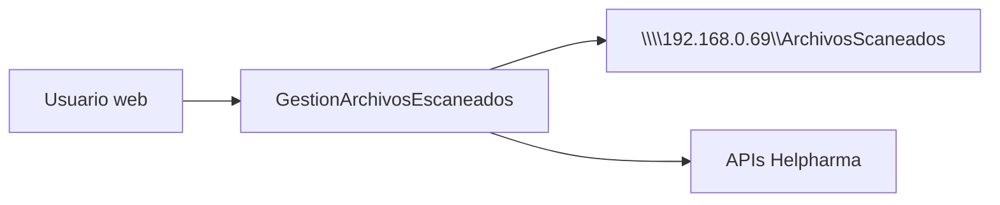

# Plan de Ejecución — Portal MVC (`GestionArchivosEscaneados`)

| Campo | Valor |
|-------|-------|
| **Documento** | `PlanesEjecucion/Individual/CreacionMVC.md` |
| **Basado en** | [Manual_Usuario_Worker_Masivo_v3.md](../../Manual/Manual_Usuario_Worker_Masivo_v3.md) §7 |
| **Plan sistema** | [PlanEjecucion-Sistema-Masivos-v3.md](../PlanEjecucion-Sistema-Masivos-v3.md) |
| **Proyecto** | `GestionArchivosEscaneados/` *(nuevo)* |
| **Stack** | ASP.NET Core MVC — **.NET 10** |
| **Despliegue** | **IIS** (Windows Server) |
| **Fecha** | 2026-06-03 |
| **Estado** | Decisiones cerradas — listo para implementar |
| **Depende de** | Worker 1 + Worker 2 generando estructura UNC, `noprocesados` y `log\{fecha}.txt` |

---

## 1. Objetivo del portal

Aplicación web para que usuarios registrados en `usuarios.txt` consulten sus escaneos y **reprocesen manualmente** PDFs en `noprocesados`, invocando las **mismas APIs Helpharma** que Worker 2 (mismo comportamiento funcional, **código propio del MVC**).



**Alcance:** portal MVC únicamente. **No modifica** Worker 1 ni Worker 2.

**Independencia total (decisión D-02):** el MVC **no referencia** proyectos `MasivosWorker/` ni `MoverDocumentos/`. Toda la lógica (UNC, log diario, integración API, auth) vive dentro de `GestionArchivosEscaneados/`. Debe **replicar el contrato funcional** documentado en el manual (mismos endpoints, mismos mensajes, mismas rutas UNC).

**Fuera de alcance:**
- OpenAI desde el MVC
- Creación de carpetas del día (Worker 1)
- Procesamiento automático por lotes (Worker 2)
- Contraseña en login

---

## 2. Arquitectura en capas (.NET 10) — **DECISIÓN D-01**

```
GestionArchivosEscaneados/
├── GestionArchivosEscaneados.slnx
│
├── GestionArchivosEscaneados.Web/              ← ASP.NET Core MVC (Controllers, Views, wwwroot)
│
├── GestionArchivosEscaneados.Application/      ← Casos de uso (orquestación)
│   ├── Auth/
│   ├── Calendario/
│   ├── Dashboard/
│   └── Reproceso/
│
├── GestionArchivosEscaneados.Models/           ← DTOs, Entities, Enums, ViewModels
│
├── GestionArchivosEscaneados.Constants/        ← Textos reutilizables (mensajes §7.2, §7.9, labels UI)
│
├── GestionArchivosEscaneados.Infrastructure/   ← UNC, usuarios.txt, log diario, HttpClient APIs
│
└── GestionArchivosEscaneados.Tests/            ← xUnit
```

### Reglas de dependencia

| Capa | Referencia |
|------|------------|
| `Web` | Application, Constants, Models (ViewModels) |
| `Application` | Models, Constants, Infrastructure (vía interfaces) |
| `Infrastructure` | Models, Constants |
| `Constants` | *(ninguna)* |
| `Models` | *(ninguna)* |

**Prohibido:** `ProjectReference` a `MasivosWorker/*` o `MoverDocumentos/*`.

### Componentes a implementar en Infrastructure (equivalente funcional, código propio)

| Servicio MVC | Responsabilidad | Referencia funcional (solo lectura) |
|--------------|-----------------|-------------------------------------|
| `UncStorageService` | Listar fechas, PDFs, mover archivos, servir stream | Manual §7.3–§7.6 |
| `LogDiarioService` | Leer/incrementar `{fecha}\log\{fecha}.txt` | Worker 2 `LogDiarioService` (copiar lógica, no referencia) |
| `UsuarioAuthService` | Validar `usuarios.txt` | Manual §7.1 |
| `SoporteProcesamientoService` | Orquestar APIs datos + física | Worker 2 homónimo (copiar contrato HTTP) |
| `RutasLoteHelper` | Derivar rutas `{usuario}\{fecha}\*` | Worker 2 `RutasLoteResolver` (copiar lógica) |

---

## 3. Decisiones cerradas

| ID | Decisión | Respuesta |
|----|----------|-----------|
| **D-01** | Capas | `Web`, `Application`, `Models`, `Constants`, `Infrastructure`, `Tests` |
| **D-02** | Compartir código con workers | **No.** Proyecto 100 % independiente |
| **D-03** | Home MVP | **Calendario**; al seleccionar fecha → validar que existe carpeta `{fecha}` |
| **D-04** | Totales en calendario (MVC-24) | **No en MVP.** Totales solo en Dashboard al entrar a una fecha (ver §3.1) |
| **D-05** | Columna CodigoBarras | **Siempre vacía**; el usuario mira el PDF y escribe el código manualmente |
| **D-06** | Despliegue | **IIS** |
| **D-07** | `ApiCredentials.IdUsuario` | **Usuario de sesión** (minúsculas, ej. `alejandro.ortiz`) |
| **D-08** | Credenciales UNC | Ver §3.2 — pendiente confirmación Infra de cuenta app pool |
| **D-09** | Nombre proyecto | **`GestionArchivosEscaneados`** |
| **D-10** | UI/UX | Skills de UI/UX + mejores prácticas web (ver §3.3) |

### 3.1 Aclaración D-04 (totales en Home)

**Opción pospuesta (MVC-24):** en el calendario del Home, mostrar junto a cada fecha badges como *"100 procesados / 12 pendientes"* leyendo el log de **todas** las fechas.

**MVP acordado:** el calendario solo muestra **fechas disponibles** (nombres de carpetas). Los totales `CantidadProcesados` / `NoProcesados` se ven **solo en el Dashboard** después de elegir una fecha válida.

### 3.2 Aclaración D-08 (credenciales UNC en IIS)

En IIS, cada sitio corre bajo una **identidad del Application Pool** (cuenta Windows). Esa cuenta es quien accede a `\\192.168.0.69\ArchivosScaneados`.

**Infra debe:**
1. Elegir la cuenta (ej. `DOMINIO\svc_gestion_escaneados` o identidad personalizada del pool).
2. Dar permisos **lectura/escritura** en la UNC para las carpetas de usuario.
3. Documentar la cuenta en el runbook de despliegue.

**Pendiente confirmar con Infra:** ¿qué cuenta usará el Application Pool?

### 3.3 UI/UX (D-10)

Al implementar vistas, usar skills de diseño web instaladas o agregar desde [skills.sh](https://skills.sh/):

| Skill sugerida | Uso |
|----------------|-----|
| `vercel-labs/agent-skills` → `web-design-guidelines` | Accesibilidad, layout, responsive |
| `anthropics/skills` → `frontend-design` | Calidad visual del portal |
| `nextlevelbuilder/ui-ux-pro-max-skill` → `ui-ux-pro-max` | Patrones UX (si no está instalada: `npx skills add nextlevelbuilder/ui-ux-pro-max-skill`) |

Stack UI base: **Bootstrap 5** + componentes accesibles; calendario claro; tabla + panel PDF lado a lado; feedback visible en reproceso.

---

## 4. Configuración (`appsettings.json`)

```json
{
  "Rutas": {
    "RaizUnc": "\\\\192.168.0.69\\ArchivosScaneados",
    "CarpetaUsuarios": "Usuarios",
    "ArchivoUsuarios": "usuarios.txt"
  },
  "ApiCredentials": {
    "SoporteApiKey": "...",
    "SoporteFisicoToken": "...",
    "IdUsuario": ""
  },
  "Session": {
    "TimeoutMinutes": 60
  }
}
```

- `IdUsuario` en runtime: se sobrescribe con el **usuario de sesión** (D-07).
- Secretos: User Secrets (dev) / variables de entorno IIS (prod).

---

## 5. Requerimientos funcionales

### RF-01 — Login (§7.1, §7.2)

| ID | Requerimiento |
|----|---------------|
| RF-01.1 | Solo campo **usuario** (sin contraseña) |
| RF-01.2 | Validar contra `{RaizUnc}\Usuarios\usuarios.txt` |
| RF-01.3 | Comparación **UPPERCASE** |
| RF-01.4 | Sesión con usuario en **minúsculas** |
| RF-01.5 | Usuario inexistente → texto en `Constants` (§7.2) |

### RF-02 — Home calendario (§7.3)

| ID | Requerimiento |
|----|---------------|
| RF-02.1 | Calendario con fechas = subcarpetas `YYYY-MM-DD` bajo `{RaizUnc}\{usuario}\` |
| RF-02.2 | Orden lógico (mes/año navegable) |
| RF-02.3 | Al seleccionar fecha → **validar carpeta existe**; si no, mensaje claro |
| RF-02.4 | No leer logs en Home (MVP) |

### RF-03 — Dashboard (§7.4)

| ID | Requerimiento |
|----|---------------|
| RF-03.1 | Leer `{fecha}\log\{fecha}.txt` |
| RF-03.2 | Mostrar `CantidadProcesados` y `NoProcesados` |
| RF-03.3 | Log ausente → `0` / `0` |

### RF-04 — Tabla no procesados (§7.5)

| ID | Requerimiento |
|----|---------------|
| RF-04.1 | PDFs en `noprocesados` |
| RF-04.2 | Columnas: NombreArchivo, Fecha, **CodigoBarras (vacío)**, BotonVer |
| RF-04.3 | Campo código + **Procesar** por fila o panel |

### RF-05 — Visor PDF (§7.6)

| ID | Requerimiento |
|----|---------------|
| RF-05.1 | Endpoint autorizado (`FileStreamResult`) |
| RF-05.2 | PDF.js: zoom, scroll, páginas |

### RF-06 — Reproceso manual (§7.7–§7.9)

| ID | Requerimiento |
|----|---------------|
| RF-06.1 | `SoporteProcesamientoService.ProcesarAsync(codigo, rutaPdf)` — implementación MVC |
| RF-06.2 | `IdUsuario` = usuario sesión |
| RF-06.3 | Éxito: mover a `procesados`, incrementar log, quitar fila |
| RF-06.4 | Fallo API: mensaje `Constants` §7.9; PDF en `noprocesados` |
| RF-06.5 | Anti doble-submit |

---

## 6. Plan de tareas

### Fase A — Scaffold (días 1–2)

| ID | Tarea |
|----|-------|
| MVC-01 | Solución `GestionArchivosEscaneados.slnx` + proyectos capas .NET 10 |
| MVC-02 | `Constants`: mensajes §7.2, §7.9, labels |
| MVC-03 | `appsettings` + User Secrets |
| MVC-04 | `Infrastructure`: `UncStorageService`, `RutasLoteHelper` |

### Fase B — Auth (días 2–3)

| ID | Tarea |
|----|-------|
| MVC-10 | Vista Login |
| MVC-11 | `UsuarioAuthService` + usuarios.txt |
| MVC-12 | Cookie/sesión |
| MVC-13 | Mensaje usuario inexistente |
| MVC-14 | Tests auth UPPERCASE |

### Fase C — Calendario y dashboard (días 3–5)

| ID | Tarea |
|----|-------|
| MVC-20 | `ListarFechasAsync` + UI **calendario** |
| MVC-21 | Validar carpeta al seleccionar fecha |
| MVC-22 | Dashboard + `LogDiarioService` (propio) |
| MVC-24 | *(Pospuesto)* Totales en calendario |

### Fase D — Tabla, visor, reproceso (días 5–9)

| ID | Tarea |
|----|-------|
| MVC-30 | Tabla; CodigoBarras vacío |
| MVC-31–33 | Listar PDFs, endpoint, PDF.js |
| MVC-34 | Campo código + Procesar |
| MVC-40 | `SoporteProcesamientoService` (propio) + APIs |
| MVC-41–43 | Éxito/fallo, log, anti-duplicado |
| MVC-44 | Tests mock API |

### Fase E — IIS y E2E (días 9–12)

| ID | Tarea |
|----|-------|
| MVC-50 | Publicar en **IIS**; app pool + permisos UNC (D-08) |
| MVC-51 | E2E: login → calendario → dashboard → ver PDF → reproceso OK |
| MVC-52 | E2E reproceso fallido |
| MVC-53 | Manual v3 §9 actualizado |

**Estimación:** 10–12 días hábiles.

---

## 7. Textos en `Constants` (ejemplos)

```csharp
// GestionArchivosEscaneados.Constants/MensajesUsuario.cs
public static class MensajesUsuario
{
    public const string UsuarioNoRegistrado =
        "No ha subido archivos al sistema.\nEn caso de dudas contacte al administrador.";

    public const string DocumentoNoEncontrado =
        "No se encontró información del documento.\nContacta con el administrador.";
}
```

---

## 8. Matriz de pruebas

| ID | Escenario | Resultado |
|----|-----------|-----------|
| T-MVC-01 | Login OK | Sesión activa |
| T-MVC-02 | Login fallido | Mensaje Constants §7.2 |
| T-MVC-03 | Calendario | Solo fechas con carpeta real |
| T-MVC-04 | Fecha sin carpeta | Error UI claro |
| T-MVC-05 | CodigoBarras columna | Siempre vacío |
| T-MVC-06 | Reproceso OK | PDF en procesados; log +1 |
| T-MVC-07 | Reproceso fallo | Mensaje §7.9 |
| T-MVC-08 | E2E workers + MVC | Flujo completo piloto |

---

## 9. Prerrequisitos

| ID | Prerrequisito |
|----|---------------|
| PRE-01 | UNC operativa con datos de Worker 1/2 |
| PRE-02 | Usuario en `usuarios.txt` |
| PRE-03 | IIS + cuenta app pool con RW en UNC (**D-08**) |
| PRE-04 | Credenciales API Helpharma |
| PRE-05 | Skills UI/UX disponibles en entorno dev |

---

## 10. Desviación respecto al manual v3 §3.4

El manual original pedía **referenciar** `MasivosWorker/Services`. Por decisión **D-02**, el MVC es independiente: se mantiene **paridad funcional** (mismos endpoints, mensajes y rutas) pero el código se **implementa dentro** de `GestionArchivosEscaneados/`. Actualizar manual cuando el portal esté en producción.

---

## 11. Referencias

| Documento | Ubicación |
|-----------|-----------|
| Manual §7 | `Manual/Manual_Usuario_Worker_Masivo_v3.md` |
| Comportamiento API (referencia) | `MasivosWorker/Services/SoporteProcesamientoService.cs` |
| Log diario (referencia) | `MasivosWorker/Infrastructure/LogDiarioService.cs` |
| Skills UI | [skills.sh](https://skills.sh/) |

---

*Fin del plan — GestionArchivosEscaneados.*
