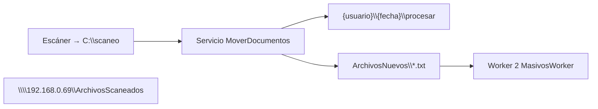

# Plan de Ejecución — Creación Worker 1 (`MoverDocumentos`)

| Campo | Valor |
|-------|-------|
| **Documento** | `PlanesEjecucion/Individual/CreacionWorker1.md` |
| **Basado en** | [Manual_Usuario_Worker_Masivo_v3.md](../../Manual/Manual_Usuario_Worker_Masivo_v3.md) §4, §5 |
| **Plan sistema** | [PlanEjecucion-Sistema-Masivos-v3.md](../PlanEjecucion-Sistema-Masivos-v3.md) |
| **Proyecto** | `MoverDocumentos/` *(nuevo)* |
| **Servicio Windows** | `MoverDocumentos` |
| **Fecha** | 2026-06-02 |
| **Estado** | Implementado (código base); piloto W1-61 pendiente |

---

## 1. Objetivo del Worker 1

Instalar en **cada PC de escaneo** un servicio Windows que:

1. Escuche PDFs en `C:\scaneo`.
2. Detecte al usuario corporativo del equipo.
3. Registre al usuario en `usuarios.txt` (si no existe).
4. Cree la estructura de carpetas del día en la unidad compartida.
5. **Mueva** (nunca copie) los PDF a `{usuario}\{fecha}\procesar`.
6. Genere un archivo `.txt` de lote en `ArchivosNuevos` para que **Worker 2** (`MasivosWorker`) procese.



**Alcance de este plan:** solo Worker 1. No incluye procesamiento barcode, APIs ni portal MVC.

---

## 2. Requerimientos funcionales

### RF-01 — Carpeta local de escaneo

| ID | Requerimiento | Prioridad |
|----|---------------|-----------|
| RF-01.1 | Al iniciar el servicio, validar existencia de `C:\scaneo` | 🔴 |
| RF-01.2 | Si no existe, crearla automáticamente | 🔴 |
| RF-01.3 | El escáner del usuario debe configurarse para depositar PDF en esa ruta | 🔴 (operativo) |

**Referencia manual:** §5.1

---

### RF-02 — Detección y normalización de usuario

| ID | Requerimiento | Prioridad |
|----|---------------|-----------|
| RF-02.1 | Obtener correo/UPN del usuario autenticado en Windows | 🔴 |
| RF-02.2 | Extraer la parte **antes del** `@` | 🔴 |
| RF-02.3 | Convertir a **minúsculas** | 🔴 |
| RF-02.4 | Conservar puntos y estructura del nombre (no truncar apellidos compuestos) | 🔴 |

**Casos de prueba obligatorios:**

| Entrada | Salida esperada |
|---------|-----------------|
| `Alejandro.Ortiz@zentria.com.co` | `alejandro.ortiz` |
| `alejandro.ortiz.gaviria@zentria.com.co` | `alejandro.ortiz.gaviria` |

**Referencia manual:** §5.2

---

### RF-03 — Registro en `usuarios.txt`

| ID | Requerimiento | Prioridad |
|----|---------------|-----------|
| RF-03.1 | Ruta: `\\192.168.0.69\ArchivosScaneados\Usuarios\usuarios.txt` | 🔴 |
| RF-03.2 | Al primer movimiento exitoso, abrir el archivo y verificar si el usuario existe | 🔴 |
| RF-03.3 | Si no existe, agregar **una línea** con el usuario en minúsculas | 🔴 |
| RF-03.4 | No duplicar líneas si el usuario ya está registrado | 🔴 |
| RF-03.5 | Mantener flag interno `UsuarioRegistrado` en memoria para no releer el archivo en cada PDF | 🟡 |
| RF-03.6 | Acceso concurrente seguro (bloqueo al escribir) | 🔴 |

**Referencia manual:** §5.3, §4.3

---

### RF-04 — Escucha continua de PDFs

| ID | Requerimiento | Prioridad |
|----|---------------|-----------|
| RF-04.1 | Escuchar permanentemente `C:\scaneo` | 🔴 |
| RF-04.2 | Procesar solo archivos `*.pdf` | 🔴 |
| RF-04.3 | Procesar **todos** los PDF que lleguen, sin límite de cantidad | 🔴 |
| RF-04.4 | Esperar a que el archivo esté completamente escrito (tamaño estable) antes de mover | 🔴 |
| RF-04.5 | Escaneo periódico de respaldo (recomendado: cada 30 s) por pérdida de eventos del watcher | 🟡 |

**Referencia manual:** §5.4

---

### RF-05 — Estructura de carpetas en red

| ID | Requerimiento | Prioridad |
|----|---------------|-----------|
| RF-05.1 | Raíz UNC: `\\192.168.0.69\ArchivosScaneados` | 🔴 |
| RF-05.2 | Crear `{RaizUnc}\{usuario}\{fecha}` si no existe | 🔴 |
| RF-05.3 | `{fecha}` = fecha local del PC en formato `YYYY-MM-DD` | 🔴 |
| RF-05.4 | Crear subcarpetas en **minúsculas**: `procesar`, `procesando`, `procesaria`, `noprocesados`, `procesados`, `error`, `log` | 🔴 |
| RF-05.5 | Worker 1 solo **escribe** en `procesar`; las demás carpetas las usa Worker 2 | 🔴 |

**Ejemplo:**

```text
\\192.168.0.69\ArchivosScaneados\alejandro.ortiz\2026-06-02\procesar
```

**Referencia manual:** §4.2, §5.5

---

### RF-06 — Movimiento de archivos

| ID | Requerimiento | Prioridad |
|----|---------------|-----------|
| RF-06.1 | Operación: **mover** (cut/paste), **nunca** copiar | 🔴 |
| RF-06.2 | Origen: `C:\scaneo` | 🔴 |
| RF-06.3 | Destino: `...\{usuario}\{fecha}\procesar` | 🔴 |
| RF-06.4 | Tras mover, el PDF **no** debe permanecer en `C:\scaneo` | 🔴 |

**Referencia manual:** §5.6

---

### RF-07 — Nombres duplicados

| ID | Requerimiento | Prioridad |
|----|---------------|-----------|
| RF-07.1 | Si en destino ya existe `Factura.pdf`, renombrar a `Factura(1).pdf` | 🔴 |
| RF-07.2 | Incrementar: `Factura(2).pdf`, `Factura(3).pdf`, … hasta nombre libre | 🔴 |
| RF-07.3 | **Nunca** sobrescribir un archivo existente | 🔴 |

**Referencia manual:** §5.7

---

### RF-08 — Archivo TXT de lote (handoff a Worker 2)

| ID | Requerimiento | Prioridad |
|----|---------------|-----------|
| RF-08.1 | Generar **1 TXT por lote** en `\\192.168.0.69\ArchivosScaneados\ArchivosNuevos` | 🔴 |
| RF-08.2 | Nombre: `{usuario}-{YYYY-MM-DD} {HH-mm-ss}{AM\|PM}.txt` — ej. `alejandro.ortiz-2026-06-03 08-42-51AM.txt` | 🔴 |
| RF-08.3 | Contenido: **una sola línea** con ruta UNC absoluta a `procesar` (Worker 2 la lee al abrir el archivo) | 🔴 |
| RF-08.4 | Cierre de lote por **inactividad** configurable (default: 60 s sin nuevos PDF) | 🔴 |
| RF-08.5 | Un lote agrupa movimientos del mismo `{usuario}` + `{fecha}` | 🔴 |
| RF-08.6 | No generar TXT duplicado para la misma ruta `procesar` si ya se notificó y no hubo nuevos archivos | 🟡 |

**Ejemplo de contenido (lo que Worker 2 lee al abrir el TXT):**

```text
\\192.168.0.69\ArchivosScaneados\alejandro.ortiz\2026-06-03\procesar
```

**Referencia manual:** §5.8

---

### RF-09 — Resiliencia ante fallo de red

| ID | Requerimiento | Prioridad |
|----|---------------|-----------|
| RF-09.1 | Antes de mover, verificar acceso a `RaizUnc` | 🔴 |
| RF-09.2 | Si la red/UNC no está disponible: registrar error en **Visor de eventos de Windows** | 🔴 |
| RF-09.3 | **No mover** el PDF; debe permanecer en `C:\scaneo` | 🔴 |
| RF-09.4 | Reintentar automáticamente (intervalo configurable, default 30 s) | 🔴 |
| RF-09.5 | **Nunca perder archivos** por caída temporal de la unidad compartida | 🔴 |

**Referencia manual:** §5.9

---

## 3. Requerimientos no funcionales

| ID | Requerimiento | Detalle |
|----|---------------|---------|
| RNF-01 | Plataforma | .NET 10, alineado con `MasivosWorker` |
| RNF-02 | Tipo de aplicación | Servicio Windows (`Microsoft.Extensions.Hosting.WindowsServices`) |
| RNF-03 | Logging | Visor de eventos (Registros de Windows → Aplicación) + consola en desarrollo |
| RNF-04 | Configuración | `appsettings.json` junto al ejecutable; credenciales UNC **no** hardcodeadas |
| RNF-05 | Convención de logs | Formato `Clave=Valor` (igual que MasivosWorker) |
| RNF-06 | Idioma de carpetas | Siempre minúsculas en rutas creadas |
| RNF-07 | Instalación | Script o guía para registrar/desinstalar servicio en PC cliente |
| RNF-08 | Concurrencia | Cola/semáforo si llegan muchos PDF simultáneos; un movimiento a la vez por archivo |

---

## 4. Prerrequisitos de infraestructura (antes de desarrollo en red real)

| ID | Tarea | Responsable | Estado |
|----|-------|-------------|--------|
| PRE-01 | Acceso a `\\192.168.0.69\ArchivosScaneados` desde PC piloto | Infra | ⏳ |
| PRE-02 | Credenciales de red (`escaneados`) en configuración segura | Infra | ⏳ |
| PRE-03 | Carpetas raíz: `Usuarios\`, `ArchivosNuevos\` | Infra | ⏳ |
| PRE-04 | Archivo `Usuarios\usuarios.txt` (vacío o con pilotos) | Infra | ⏳ |
| PRE-05 | Permisos NTFS: escritura para cuenta del servicio en UNC | Infra | ⏳ |
| PRE-06 | Escáner configurado a `C:\scaneo` en PC piloto | Operaciones | ⏳ |

> Desarrollo local puede usar rutas UNC simuladas con carpetas locales (`appsettings.Development.json`).

---

## 5. Arquitectura propuesta del proyecto

```text
MoverDocumentos/
├── MoverDocumentos.sln
├── MoverDocumentos/                    ← Host Worker + Program.cs
├── MoverDocumentos.Core/               ← Lógica (opcional; puede ser una sola capa al inicio)
│   ├── Configuration/
│   │   ├── RutasSettings.cs
│   │   ├── RedSettings.cs
│   │   └── LoteSettings.cs
│   └── Services/
│       ├── UsuarioService.cs           ← RF-02
│       ├── RegistroUsuarioService.cs   ← RF-03
│       ├── EstructuraCarpetasService.cs← RF-05
│       ├── RedDisponibleService.cs     ← RF-09
│       ├── MoverArchivoService.cs      ← RF-06, RF-07
│       ├── LoteService.cs              ← RF-08
│       └── EscaneoWatcherService.cs    ← RF-04 (BackgroundService)
└── MoverDocumentos.Tests/
```

**Patrones a reutilizar de `MasivosWorker`:**

- `FileSystemWatcher` + escaneo periódico de respaldo
- Espera de archivo estable (tamaño constante N lecturas)
- `AddWindowsService` en `Program.cs`
- `ContentRootPath = AppContext.BaseDirectory` para encontrar `appsettings.json` como servicio

---

## 6. Configuración (`appsettings.json`)

```json
{
  "Rutas": {
    "CarpetaLocal": "C:\\scaneo",
    "RaizUnc": "\\\\192.168.0.69\\ArchivosScaneados",
    "CarpetaArchivosNuevos": "ArchivosNuevos",
    "CarpetaUsuarios": "Usuarios",
    "ArchivoUsuarios": "usuarios.txt",
    "SubcarpetasDia": [
      "procesar",
      "procesando",
      "procesaria",
      "noprocesados",
      "procesados",
      "error",
      "log"
    ]
  },
  "Red": {
    "Usuario": "",
    "Clave": "",
    "UsarCredencialesConfiguradas": false
  },
  "Lote": {
    "SegundosInactividadParaCerrarLote": 60,
    "FormatoHoraEnNombreTxt": "yyyy-MM-dd HH-mm-ss tt"
  },
  "Archivo": {
    "EsperaIntentos": 120,
    "EsperaMs": 500,
    "LecturasEstables": 2,
    "EscaneoRespaldoSegundos": 30
  },
  "Reintentos": {
    "IntervaloSegundosRed": 30
  },
  "Logging": {
    "LogLevel": {
      "Default": "Information",
      "Microsoft.Hosting.Lifetime": "Information"
    }
  }
}
```

---

## 7. Plan de tareas de implementación

### Fase A — Scaffold (día 1–2)

| ID | Tarea | RF | Estado |
|----|-------|-----|--------|
| W1-01 | Crear solución y proyecto `MoverDocumentos` (.NET 10 Worker) | RNF-01 | ⏳ |
| W1-02 | Registrar servicio Windows `MoverDocumentos` | RNF-02 | ⏳ |
| W1-03 | Modelos de configuración + `appsettings.json` / Development | RNF-04 | ⏳ |
| W1-04 | Logging a Event Log + consola | RNF-03 | ⏳ |
| W1-05 | `Worker.cs`: crear `C:\scaneo` al iniciar | RF-01 | ⏳ |

---

### Fase B — Usuario y registro (día 2–3)

| ID | Tarea | RF | Estado |
|----|-------|-----|--------|
| W1-10 | `UsuarioService.ObtenerUsuarioNormalizado()` | RF-02 | ⏳ |
| W1-11 | `RegistroUsuarioService.RegistrarSiNoExiste()` | RF-03 | ⏳ |
| W1-12 | Cache `UsuarioRegistrado` en sesión del servicio | RF-03.5 | ⏳ |
| W1-13 | Tests unitarios casos §5.2 | RF-02 | ⏳ |

---

### Fase C — Carpetas y red (día 3–4)

| ID | Tarea | RF | Estado |
|----|-------|-----|--------|
| W1-20 | `EstructuraCarpetasService.CrearEstructuraDia(usuario, fecha)` | RF-05 | ⏳ |
| W1-21 | `RedDisponibleService.EstaDisponible()` | RF-09.1 | ⏳ |
| W1-22 | Conexión UNC con credenciales si aplica | PRE-02, RNF-04 | ⏳ |

---

### Fase D — Watcher y movimiento (día 4–6)

| ID | Tarea | RF | Estado |
|----|-------|-----|--------|
| W1-30 | `EscaneoWatcherService`: FileSystemWatcher `*.pdf` | RF-04 | ⏳ |
| W1-31 | Espera archivo estable | RF-04.4 | ⏳ |
| W1-32 | `MoverArchivoService.Mover(origen, destinoProcesar)` con `File.Move` | RF-06 | ⏳ |
| W1-33 | Resolución nombres duplicados `(1)`, `(2)`… | RF-07 | ⏳ |
| W1-34 | Escaneo periódico carpeta local | RF-04.5 | ⏳ |
| W1-35 | Flujo completo: red OK → registrar usuario → carpetas → mover | RF-03–06 | ⏳ |

---

### Fase E — Lotes TXT (día 6–7)

| ID | Tarea | RF | Estado |
|----|-------|-----|--------|
| W1-40 | `LoteService`: abrir/cerrar lote por usuario+fecha | RF-08.5 | ⏳ |
| W1-41 | Timer inactividad → cerrar lote | RF-08.4 | ⏳ |
| W1-42 | Escribir TXT en `ArchivosNuevos` | RF-08.1–08.3 | ⏳ |
| W1-43 | Test integración: 2 PDF + espera → 1 TXT válido | RF-08 | ⏳ |

---

### Fase F — Resiliencia (día 7–8)

| ID | Tarea | RF | Estado |
|----|-------|-----|--------|
| W1-50 | Si red caída: log error, no mover, PDF en `C:\scaneo` | RF-09.2–09.3 | ⏳ |
| W1-51 | Timer reintento procesar pendientes en local | RF-09.4 | ⏳ |
| W1-52 | Test: UNC off → on → archivos se mueven | RF-09.5 | ⏳ |

---

### Fase G — Instalación y piloto (día 8–10)

| ID | Tarea | RF | Estado |
|----|-------|-----|--------|
| W1-60 | Guía instalación servicio (`sc create` / PowerShell `New-Service`) | RNF-07 | ⏳ |
| W1-61 | Piloto: 5 PDF reales → UNC `procesar` + TXT en `ArchivosNuevos` | — | ⏳ |
| W1-62 | Piloto: duplicado de nombre + desconexión red | RF-07, RF-09 | ⏳ |
| W1-63 | Actualizar manual v3 §9 (Worker 1 ✅) | — | ⏳ |

---

## 8. Mensajes de log esperados (Visor de eventos)

| Mensaje | Cuándo |
|---------|--------|
| `MoverDocumentosIniciado` | Servicio arrancó |
| `CarpetaLocalLista \| Ruta=C:\scaneo` | Carpeta local OK |
| `UsuarioDetectado \| Usuario=alejandro.ortiz` | Tras RF-02 |
| `UsuarioRegistrado \| Usuario=...` | Nueva línea en usuarios.txt |
| `EstructuraCreada \| Ruta=...` | Carpetas del día creadas |
| `ArchivoMovido \| Origen=... \| Destino=...` | Movimiento exitoso |
| `ArchivoRenombradoDuplicado \| Nombre=...` | RF-07 aplicado |
| `LoteCerrado \| Txt=... \| RutaProcesar=...` | TXT generado |
| `RedNoDisponible \| RaizUnc=...` | RF-09 — no se movió |
| `ReintentoPendientes \| Cantidad=N` | Reprocesando `C:\scaneo` |

---

## 9. Matriz de pruebas

| # | Escenario | Entrada | Resultado esperado |
|---|-----------|---------|-------------------|
| T-01 | Primer escaneo del día | 1 PDF en `C:\scaneo` | PDF en UNC `procesar`; TXT en `ArchivosNuevos` |
| T-02 | Usuario nuevo | Correo no en usuarios.txt | Línea agregada en `usuarios.txt` |
| T-03 | Usuario existente | Segundo PDF mismo día | No duplica línea en usuarios.txt |
| T-04 | Nombre duplicado | 2× `Factura.pdf` | `Factura.pdf` y `Factura(1).pdf` |
| T-05 | Red caída | UNC inaccesible | PDF permanece en `C:\scaneo`; log error |
| T-06 | Recuperación red | Tras T-05, UNC vuelve | PDFs pendientes se mueven |
| T-07 | Lote inactividad | 3 PDF en 10 s, luego silencio 60 s | 1 TXT con ruta correcta |
| T-08 | Contenido TXT | Abrir `.txt` generado | Una línea = ruta a `procesar` |
| T-09 | Carpetas minúsculas | Inspeccionar UNC | Solo nombres en minúsculas |
| T-10 | Fecha ISO | Escaneo 2026-06-02 | Carpeta `2026-06-02` |

---

## 10. Contrato con Worker 2 (`MasivosWorker`)

Worker 1 **entrega** a Worker 2:

| Artefacto | Ubicación | Consumido por |
|-----------|-----------|---------------|
| PDFs listos | `{RaizUnc}\{usuario}\{fecha}\procesar` | MasivosWorker (fase adaptación) |
| Señal de lote | `{RaizUnc}\ArchivosNuevos\*.txt` | Watcher de lotes en MasivosWorker |
| Usuarios válidos | `Usuarios\usuarios.txt` | Worker 1 (escritura) + MVC login (lectura) |
| Estructura día | Subcarpetas `procesando`, `error`, etc. | Worker 2 las usa al procesar |

**Worker 1 no debe:** leer barcode, llamar APIs Helpharma, mover archivos a `procesados`.

---

## 11. Definición de terminado (DoD)

- [ ] Proyecto `MoverDocumentos/` compila y se publica como servicio Windows.
- [ ] Todos los RF-01 a RF-09 implementados y trazables a tareas W1-xx.
- [ ] Matriz de pruebas §9 ejecutada sin defectos críticos.
- [ ] Piloto en 1 PC con escáner real completado (W1-61).
- [ ] Guía de instalación para operaciones (W1-60).
- [ ] Manual v3 §9 actualizado: Worker 1 en ✅.

---

## 12. Estimación

| Fase | Duración |
|------|----------|
| A — Scaffold | 1–2 días |
| B — Usuario | 1–2 días |
| C — Carpetas/red | 1–2 días |
| D — Watcher/movimiento | 2–3 días |
| E — Lotes TXT | 1–2 días |
| F — Resiliencia | 1–2 días |
| G — Piloto | 2–3 días |
| **Total** | **~8–12 días hábiles** (1 desarrollador) |

---

## 13. Riesgos

| Riesgo | Mitigación |
|--------|------------|
| Servicio sin permisos UNC | PRE-05 antes de piloto |
| UPN vacío en PC sin dominio | Fallback: `Environment.UserName` documentado y acordado con negocio |
| Watcher pierde eventos en copias lentas | RF-04.5 escaneo periódico |
| Antivirus bloquea `File.Move` | Reintentos + espera archivo estable |
| Criterio de lote ambiguo | Default 60 s inactividad; parametrizable en `LoteSettings` |

---

## 14. Referencias

| Documento | Ruta |
|-----------|------|
| Manual v3 — Worker 1 | `Manual/Manual_Usuario_Worker_Masivo_v3.md` §5 |
| Estructura UNC | `Manual/Manual_Usuario_Worker_Masivo_v3.md` §4 |
| Plan sistema completo | `PlanesEjecucion/PlanEjecucion-Sistema-Masivos-v3.md` |
| Worker 2 (referencia técnica watcher) | `MasivosWorker/Infrastructure/FileWatcherInfraestructure.cs` |

---

*Fin del plan — Creación Worker 1.*
