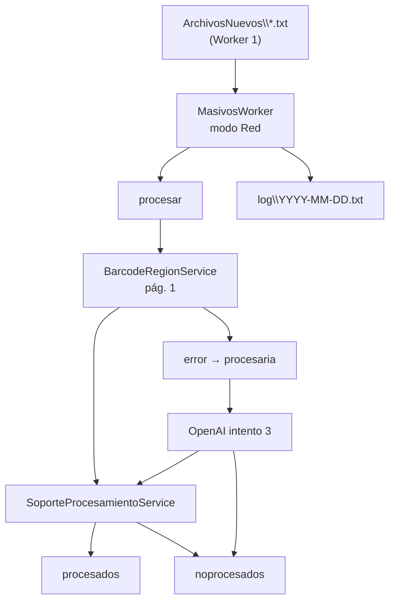
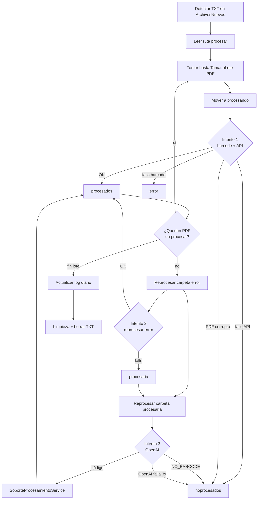

# Plan de Ejecución — Adaptación Worker 2 (`MasivosWorker`)

| Campo | Valor |
|-------|-------|
| **Documento** | `PlanesEjecucion/Individual/CreacionWorker2.md` |
| **Basado en** | [Manual_Usuario_Worker_Masivo_v3.md](../../Manual/Manual_Usuario_Worker_Masivo_v3.md) §3, §6 |
| **Plan sistema** | [PlanEjecucion-Sistema-Masivos-v3.md](../PlanEjecucion-Sistema-Masivos-v3.md) |
| **Plan Worker 1** | [CreacionWorker1.md](CreacionWorker1.md) |
| **Proyecto** | **`MasivosWorker/`** *(ya existente — adaptar, no crear desde cero)* |
| **Servicio Windows** | `MasivosWorker` |
| **Fecha** | 2026-06-02 |
| **Estado** | Núcleo operativo en local; adaptación UNC/lotes pendiente |

---

## 1. Aclaración fundamental

| Concepto | Detalle |
|----------|---------|
| **Worker 2 del manual v3** | Es el proyecto **`MasivosWorker/`** |
| **Estado actual** | Servicio Windows **funcionando** con `C:\Masivos\procesar`, barcode IronBarcode y APIs Helpharma |
| **Trabajo de este plan** | **Adaptar** el worker existente al flujo v3 (UNC, lotes TXT, reintentos, OpenAI, logs) |
| **No hacer** | Crear un segundo worker de procesamiento ni reimplementar barcode/APIs |



---

## 2. Objetivo del Worker 2 (estado objetivo v3)

Procesar automáticamente los PDF que Worker 1 dejó en la red:

1. Escuchar archivos `.txt` en `ArchivosNuevos`.
2. Procesar **un lote a la vez**, de forma **secuencial**.
3. Por lote: leer barcode (IronBarcode), consultar datos y subir PDF vía **`SoporteProcesamientoService`**.
4. Aplicar **3 niveles de intento**: `procesando` → `error` → `procesaria` (OpenAI).
5. Dejar en `noprocesados` lo que no se resuelva; actualizar **log diario**; limpiar temporales al cerrar lote.

---

## 3. Línea base ya implementada (conservar)

| ID | Componente | Ubicación | Estado |
|----|------------|-----------|--------|
| LB-01 | Host servicio Windows | `MasivosWorker/Program.cs`, `Worker.cs` | ✅ |
| LB-02 | Watcher por archivo | `Infrastructure/FileWatcherInfraestructure.cs` | ✅ |
| LB-03 | Gestión carpetas local | `Infrastructure/FileManagerInfraestructure.cs` | ✅ |
| LB-04 | Lectura barcode (solo pág. 1) | `Services/BarcodeRegionService.cs` | ✅ |
| LB-05 | API datos soporte | `Services/SoporteApiService.cs` | ✅ |
| LB-06 | API física + PDF | `Services/SoporteFisicoApiService.cs` | ✅ |
| LB-07 | Flujo unificado APIs | `Services/SoporteProcesamientoService.cs` | ✅ |
| LB-08 | Registro DI compartido (MVC) | `Services/SoporteServiceCollectionExtensions.cs` | ✅ |
| LB-09 | Reintentos lectura barcode | `ProcesarConReintentos` | ✅ |
| LB-10 | Licencia IronBarcode | `IronBarcodeLicenseInitializer` | ✅ |
| LB-11 | Modo actual `C:\Masivos` | `appsettings.json` → `Rutas` | ✅ |

**Flujo actual (modo Legacy):**

```text
procesar → procesando → barcode → SoporteProcesamientoService → procesados
                                    ↓ fallo barcode/API
                                  error (sin segundo intento automático en red)
```

---

## 4. Brecha: comportamiento actual vs manual v3

| Tema | Hoy (Legacy) | Objetivo v3 (modo Red) |
|------|--------------|------------------------|
| Disparador | PDF en `C:\Masivos\procesar` | TXT en `ArchivosNuevos` |
| Rutas | Fijas locales | Dinámicas por lote (`{usuario}\{fecha}\...`) |
| Paralelismo lotes | N/A | 1 TXT a la vez |
| Tamaño de tanda | 1 archivo (semáforo 2) | Parametrizable: 3 PDF por tanda |
| Fallo API | `error` | `noprocesados` (sin auto-reintento) |
| Fallo barcode intento 1 | `error` | `error` |
| Intento 2 | Manual (usuario mueve a procesar) | Auto desde `error` |
| Intento 3 | No existe | OpenAI desde `procesaria` |
| PDF corrupto | `error` | `noprocesados` |
| Log diario | No | `{fecha}.txt` acumulativo en `log` |
| Limpieza post-lote | No | Borrar archivos en carpetas temporales |
| Correo OpenAI | No | 1 correo por lote fallido |
| Prefijo `CRC_900277244_` | Sí al mover | ⚠️ Definir con negocio en UNC |

---

## 5. Requerimientos funcionales

### RF-01 — Escucha de nuevos lotes

| ID | Requerimiento | Prioridad |
|----|---------------|-----------|
| RF-01.1 | Escuchar permanentemente `\\192.168.0.69\ArchivosScaneados\ArchivosNuevos` | 🔴 |
| RF-01.2 | Detectar archivos `*.txt` nuevos (ej. `alejandro.ortiz-2026-06-03 08-42-51AM.txt`) | 🔴 |
| RF-01.3 | Por cada TXT nuevo: **abrir el archivo**, leer línea 1 y usar esa ruta como carpeta `procesar` | 🔴 |
| RF-01.4 | **No** inferir la ruta de procesamiento desde el nombre del TXT | 🔴 |
| RF-01.5 | Modo `Legacy`: mantener watcher actual en `C:\Masivos` hasta corte de producción | 🟡 |

**Referencia manual:** §6.1

---

### Referencia operativa — TXT en `ArchivosNuevos`

Flujo confirmado en entorno real:

```text
Carpeta vigilada:
  \\192.168.0.69\ArchivosScaneados\ArchivosNuevos

Archivos detectados (ejemplo):
  alejandro.ortiz-2026-06-03 08-41-20AM.txt
  alejandro.ortiz-2026-06-03 08-42-51AM.txt

Al abrir alejandro.ortiz-2026-06-03 08-42-51AM.txt → línea 1:
  \\192.168.0.69\ArchivosScaneados\alejandro.ortiz\2026-06-03\procesar
                                                          ↑
                                    Worker 2 procesa PDFs de ESTA carpeta
```

---

### RF-02 — Procesamiento secuencial de lotes

| ID | Requerimiento | Prioridad |
|----|---------------|-----------|
| RF-02.1 | Procesar **un TXT a la vez** | 🔴 |
| RF-02.2 | TXT1 → completar todo el ciclo → TXT2 → completar todo el ciclo | 🔴 |
| RF-02.3 | No procesar dos lotes en paralelo | 🔴 |

**Referencia manual:** §6.2

---

### RF-03 — Lectura del archivo de lote (contenido → ruta `procesar`)

| ID | Requerimiento | Prioridad |
|----|---------------|-----------|
| RF-03.1 | Abrir el `.txt` detectado en modo lectura | 🔴 |
| RF-03.2 | Leer **línea 1** completa; hacer trim de espacios y `\r\n` | 🔴 |
| RF-03.3 | La línea 1 es la **ruta UNC absoluta** a la carpeta `procesar` — única fuente de verdad | 🔴 |
| RF-03.4 | Validar que la carpeta `procesar` existe en red | 🔴 |
| RF-03.5 | Si línea vacía o ruta inválida: log error, no procesar, conservar TXT para revisión | 🔴 |
| RF-03.6 | Ejemplo válido: `\\192.168.0.69\ArchivosScaneados\alejandro.ortiz\2026-06-03\procesar` | 🔴 |
| RF-03.7 | Derivar rutas hermanas reemplazando `\procesar` por `\procesando`, `\error`, etc. | 🔴 |

**Pseudocódigo obligatorio:**

```csharp
var rutaProcesar = (await File.ReadAllLinesAsync(rutaTxt))[0].Trim();
if (!Directory.Exists(rutaProcesar))
    throw new InvalidOperationException($"Carpeta procesar no existe: {rutaProcesar}");
// procesar PDFs en rutaProcesar
```

**Referencia manual:** §6.3

---

### RF-04 — Tamaño de lote (tanda de PDF)

| ID | Requerimiento | Prioridad |
|----|---------------|-----------|
| RF-04.1 | Parámetro `TamanoLote` configurable (valor inicial: **3**) | 🔴 |
| RF-04.2 | Tomar hasta N PDF de `procesar` | 🔴 |
| RF-04.3 | Moverlos a `procesando` y procesarlos | 🔴 |
| RF-04.4 | Repetir hasta vaciar `procesar` del lote | 🔴 |

**Referencia manual:** §6.4

---

### RF-05 — Primera lectura (IronBarcode + APIs)

| ID | Requerimiento | Prioridad |
|----|---------------|-----------|
| RF-05.1 | Usar `BarcodeRegionService.ProcesarPdf` (ya implementado) | 🔴 |
| RF-05.2 | Solo analizar **primera página** del PDF | 🔴 |
| RF-05.3 | Enviar PDF **completo** en endpoint 2 | 🔴 |
| RF-05.4 | Tras barcode válido, llamar `SoporteProcesamientoService.ProcesarAsync` | 🔴 |
| RF-05.5 | No duplicar llamadas HTTP fuera de `SoporteProcesamientoService` | 🔴 |

**Referencia manual:** §6.5, §6.6, §3.3–§3.4

---

### RF-06 — Primer intento (`procesando`)

| ID | Requerimiento | Prioridad |
|----|---------------|-----------|
| RF-06.1 | Origen: carpeta `procesando` del lote | 🔴 |
| RF-06.2 | Éxito (barcode + APIs OK) → mover a `procesados` | 🔴 |
| RF-06.3 | Fallo lectura barcode o excepción de procesamiento → mover a `error` | 🔴 |

**Referencia manual:** §6.7

---

### RF-07 — Segundo intento (`error`)

| ID | Requerimiento | Prioridad |
|----|---------------|-----------|
| RF-07.1 | Reprocesar archivos en `error` del mismo lote | 🔴 |
| RF-07.2 | Éxito → `procesados` | 🔴 |
| RF-07.3 | Fallo → mover a `procesaria` | 🔴 |

**Referencia manual:** §6.8

---

### RF-08 — Tercer intento (OpenAI)

| ID | Requerimiento | Prioridad |
|----|---------------|-----------|
| RF-08.1 | Procesar archivos en `procesaria` con OpenAI | 🔴 |
| RF-08.2 | Enviar solo imagen de **primera hoja** | 🔴 |
| RF-08.3 | Usar **prompt aprobado por negocio** (versionado en repo) | 🔴 |
| RF-08.4 | Respuesta: código exacto o `NO_BARCODE` | 🔴 |
| RF-08.5 | Código válido → `SoporteProcesamientoService` → `procesados` | 🔴 |
| RF-08.6 | `NO_BARCODE` → `noprocesados` | 🔴 |

**Referencia manual:** §6.9, §6.11

---

### RF-09 — Fallos de OpenAI

| ID | Requerimiento | Prioridad |
|----|---------------|-----------|
| RF-09.1 | Reintentar OpenAI **3 veces** ante timeout, auth, caída API, límite u error inesperado | 🔴 |
| RF-09.2 | Si persiste: mover documentos del lote afectado a `noprocesados` | 🔴 |
| RF-09.3 | Enviar **1 correo por lote fallido** | 🔴 |
| RF-09.4 | Correo incluye: usuario, fecha escaneo, cantidad, ruta, mensaje exacto del error | 🔴 |

#### Configuración de correo

| Campo | Valor |
|-------|-------|
| **Remitente** | `sistemas.helpharma@zentria.com.co` |
| **Destinatarios activos** | `alejandro.ortiz@zentria.com.co` |
| **Destinatario pendiente** | `diana.garces@zentria.com.co` *(en config; no enviar hasta activación)* |

**Referencia manual:** §6.10

---

### RF-10 — Archivos corruptos y fallos de API

| ID | Requerimiento | Prioridad |
|----|---------------|-----------|
| RF-10.1 | PDF corrupto/ilegible → `noprocesados` directo (sin auto-reintento) | 🔴 |
| RF-10.2 | Fallo endpoint 1 o 2 (`FalloApiDatos` / `FalloApiFisico`) → `noprocesados` | 🔴 |
| RF-10.3 | No reprocesar automáticamente fallos de API | 🔴 |

**Referencia manual:** §6.12, §6.13

---

### RF-11 — Log diario acumulativo (un archivo por carpeta `{fecha}\log\`)

| ID | Requerimiento | Prioridad |
|----|---------------|-----------|
| RF-11.1 | Archivo `{YYYY-MM-DD}.txt` en `{usuario}\{fecha}\log\` | 🔴 |
| RF-11.2 | Líneas: `CantidadProcesados:N` y `NoProcesados:M` | 🔴 |
| RF-11.3 | Valores **acumulativos** por día; cada lote suma | 🔴 |
| RF-11.4 | Ruta derivable desde carpeta `procesar` del lote (mismo `{usuario}\{fecha}`) | 🔴 |
| RF-11.5 | MVC lee **un log por fecha**; listado de fechas por **escaneo de carpetas** `{usuario}\*` | 🔴 |

**Referencia manual:** §6.14, §7.3–§7.4

---

### RF-12 — Limpieza al terminar lote

| ID | Requerimiento | Prioridad |
|----|---------------|-----------|
| RF-12.1 | Eliminar **solo archivos** (no carpetas) en: `procesados`, `procesando`, `procesaria`, `error` | 🔴 |
| RF-12.2 | **Conservar** todo en `noprocesados` | 🔴 |
| RF-12.3 | Eliminar el `.txt` del lote en `ArchivosNuevos` | 🔴 |

**Referencia manual:** §6.15

---

## 6. Requerimientos no funcionales

| ID | Requerimiento | Detalle |
|----|---------------|---------|
| RNF-01 | Proyecto existente | Evolucionar `MasivosWorker/` sin fork |
| RNF-02 | Modo dual | `ModoOperacion`: `Legacy` \| `Red` en configuración |
| RNF-03 | Compatibilidad MVC | Mantener `SoporteProcesamientoService` estable para portal |
| RNF-04 | Logging | Visor de eventos; claves `key=value` |
| RNF-05 | Configuración | `appsettings.json` + variables entorno en servidor |
| RNF-06 | Servidor | Instalar en estación/servidor con acceso UNC y APIs |
| RNF-07 | Sin pérdida de datos | Fallos no deben borrar PDF en `noprocesados` |
| RNF-08 | Refactor mínimo | Extraer lógica de `FileWatcherInfraestructure` a servicio reutilizable |

---

## 7. Prerrequisitos

| ID | Prerrequisito | Depende de |
|----|--------------|------------|
| PRE-01 | Worker 1 generando TXT en `ArchivosNuevos` (piloto) | [CreacionWorker1.md](CreacionWorker1.md) W1-61 |
| PRE-02 | Estructura UNC `{usuario}\{fecha}\` con subcarpetas | Worker 1 / Infra |
| PRE-03 | Servidor Worker 2 con acceso lectura/escritura UNC | Infra |
| PRE-04 | Credenciales APIs en `ApiCredentials` (prod) | Operaciones |
| PRE-05 | Prompt OpenAI aprobado por negocio | Negocio |
| PRE-06 | SMTP para correos de contingencia (remitente `sistemas.helpharma@zentria.com.co`) | Infra |

> **Desarrollo sin Worker 1:** crear manualmente carpetas UNC y archivos `.txt` de prueba.

---

## 8. Arquitectura de adaptación (componentes nuevos)

```text
MasivosWorker/
├── Infrastructure/
│   ├── FileWatcherInfraestructure.cs      ← refactor: extraer procesamiento unitario
│   ├── LoteWatcherInfrastructure.cs       ← NUEVO: watcher ArchivosNuevos
│   ├── LoteProcesamientoService.cs          ← NUEVO: orquesta ciclo por TXT
│   ├── FileManagerInfraestructure.cs      ← EXTENDER: rutas por contexto de lote
│   └── LogDiarioService.cs                ← NUEVO
├── Services/
│   ├── BarcodeRegionService.cs            ← sin cambios
│   ├── SoporteProcesamientoService.cs     ← sin cambios
│   ├── OpenAiBarcodeService.cs            ← NUEVO
│   └── EmailNotificationService.cs        ← NUEVO
└── Models/
    ├── RutasLoteContext.cs                ← NUEVO: rutas hermanas desde path procesar
    └── OpenAiSettings.cs                  ← NUEVO
```

**Resolución de rutas por lote (`RutasLoteResolver`):**

Dado `\\...\alejandro.ortiz\2026-06-02\procesar`, derivar:

```text
procesando, procesaria, noprocesados, procesados, error, log
```

---

## 9. Configuración objetivo (`appsettings.json` — modo Red)

```json
{
  "ModoOperacion": "Red",
  "Rutas": {
    "RaizUnc": "\\\\192.168.0.69\\ArchivosScaneados",
    "ArchivosNuevos": "ArchivosNuevos",
    "Procesar": "C:\\Masivos\\procesar",
    "Procesando": "C:\\Masivos\\Procesando",
    "Error": "C:\\Masivos\\error",
    "Procesados": "C:\\Masivos\\Procesados"
  },
  "FileSettings": {
    "TamanoLote": 3,
    "MaxArchivosConcurrentes": 2,
    "BarcodeMaxReintentos": 3,
    "KeyName": "CRC_900277244_"
  },
  "OpenAi": {
    "ApiKey": "",
    "Model": "gpt-4o",
    "TimeoutSeconds": 60,
    "MaxReintentos": 3,
    "PromptResourcePath": "Prompts/barcode-openai.txt"
  },
  "Email": {
    "Remitente": "sistemas.helpharma@zentria.com.co",
    "Destinatarios": [
      "alejandro.ortiz@zentria.com.co"
    ],
    "DestinatariosPendientes": [
      "diana.garces@zentria.com.co"
    ],
    "SmtpHost": "",
    "SmtpPort": 587,
    "Usuario": "",
    "Clave": ""
  },
  "IronBarcode": { "LicenseKey": "..." },
  "ApiCredentials": {
    "SoporteApiKey": "...",
    "SoporteFisicoToken": "...",
    "IdUsuario": "system"
  }
}
```

> En modo `Red`, las rutas de carpetas operativas se resuelven dinámicamente desde el TXT; las rutas `C:\Masivos` quedan solo para `Legacy`.

---

## 10. Flujo de procesamiento por lote (detalle)



---

## 11. Plan de tareas de implementación

### Fase A — Inventario y modo dual (día 1)

| ID | Tarea | RF | Estado |
|----|-------|-----|--------|
| W2-00 | Checklist QA: actual vs v3 §6 | — | ⏳ |
| W2-00b | `ModoOperacion`: `Legacy` \| `Red` en config y `Worker.cs` | RNF-02 | ⏳ |
| W2-01 | Extender `RutasSettings` + `RutasLoteContext` / `RutasLoteResolver` | RF-03 | ⏳ |

---

### Fase B — Orquestador de lotes (día 2–3)

| ID | Tarea | RF | Estado |
|----|-------|-----|--------|
| W2-10 | `LoteWatcherInfrastructure` en `ArchivosNuevos\*.txt`; al detectar TXT → abrir y leer ruta | RF-01, RF-03 | ⏳ |
| W2-11 | Cola secuencial un TXT (`SemaphoreSlim(1)`) | RF-02 | ⏳ |
| W2-12 | `LeerRutaProcesarDesdeTxt(rutaTxt)`: línea 1 → validar `Directory.Exists` | RF-03 | ⏳ |
| W2-13 | Eliminar TXT al cerrar lote | RF-12.3 | ⏳ |
| W2-14 | Condicionar watcher Legacy | RF-01.4 | ⏳ |

---

### Fase C — Tandas y refactor procesamiento (día 3–5)

| ID | Tarea | RF | Estado |
|----|-------|-----|--------|
| W2-20 | `FileSettings.TamanoLote` (default 3) | RF-04 | ⏳ |
| W2-21 | `LoteProcesamientoService.ProcesarLoteAsync` | RF-04 | ⏳ |
| W2-22 | Extraer `ProcesarDocumentoAsync` desde `FileWatcherInfraestructure` | RF-05, RNF-08 | ⏳ |
| W2-24 | Extender `FileManagerInfraestructure` con contexto de lote | RF-04 | ⏳ |
| W2-35 | Test: 7 PDF, TamanoLote=3 | RF-04 | ⏳ |

---

### Fase D — Reintentos y destinos (día 5–6)

| ID | Tarea | RF | Estado |
|----|-------|-----|--------|
| W2-30 | Intento 1: OK→procesados; barcode fail→error | RF-06 | ⏳ |
| W2-31 | Intento 2: error→procesados o procesaria | RF-07 | ⏳ |
| W2-32 | PDF corrupto→noprocesados | RF-10.1 | ⏳ |
| W2-33 | Fallo API→noprocesados vía `SoporteProcesamientoResult` | RF-10.2 | ⏳ |
| W2-34 | Decisión prefijo `KeyName` en UNC | — | ⏳ |

---

### Fase E — OpenAI (día 6–8)

| ID | Tarea | RF | Estado |
|----|-------|-----|--------|
| W2-40 | Archivo prompt versionado (`Prompts/barcode-openai.txt`) | RF-08.3 | ⏳ |
| W2-41 | `OpenAiBarcodeService` (imagen pág. 1) | RF-08 | ⏳ |
| W2-42 | `OpenAiSettings` en appsettings | RNF-05 | ⏳ |
| W2-43 | Intento 3 en `procesaria` | RF-08.5–08.6 | ⏳ |
| W2-44 | 3 reintentos OpenAI | RF-09.1 | ⏳ |
| W2-45 | Tests con mock HTTP OpenAI | RF-08 | ⏳ |

---

### Fase F — Correo, log y limpieza (día 8–9)

| ID | Tarea | RF | Estado |
|----|-------|-----|--------|
| W2-50 | `EmailNotificationService`: remitente `sistemas.helpharma@zentria.com.co`; enviar solo a `Destinatarios` activos | RF-09.3 | ⏳ |
| W2-51 | Plantilla correo lote fallido OpenAI (cuerpo §6.10 manual) | RF-09.4 | ⏳ |
| W2-52 | Parsear usuario/fecha desde ruta UNC | RF-09.4 | ⏳ |
| W2-53 | `DestinatariosPendientes`: `diana.garces@zentria.com.co` documentado; no enviar hasta activación | RF-09 | ⏳ |
| W2-60 | `LogDiarioService` | RF-11 | ⏳ |
| W2-62 | Incrementar contadores por archivo/lote | RF-11.3 | ⏳ |
| W2-70 | Limpieza archivos temporales post-lote | RF-12.1 | ⏳ |
| W2-71 | Preservar `noprocesados` | RF-12.2 | ⏳ |

---

### Fase G — Validación y despliegue (día 9–10)

| ID | Tarea | RF | Estado |
|----|-------|-----|--------|
| W2-80 | E2E: TXT Worker 1 → procesamiento completo | RF-01–12 | ⏳ |
| W2-81 | Escenarios: barcode OK, error→OpenAI, API→noprocesados | RF-06–10 | ⏳ |
| W2-82 | Verificar log + limpieza | RF-11–12 | ⏳ |
| W2-83 | Desplegar en servidor procesamiento | RNF-06 | ⏳ |
| W2-84 | Actualizar manual v3 §9 | — | ⏳ |

---

## 12. Mensajes de log (Visor de eventos)

| Mensaje | Cuándo |
|---------|--------|
| `LoteDetectado \| Txt=...` | Nuevo TXT en ArchivosNuevos |
| `LoteIniciado \| RutaProcesar=...` | Inicio ciclo |
| `TandaIniciada \| Cantidad=N` | Tomar TamanoLote PDF |
| `ProcesamientoIniciado \| Archivo=...` | Por PDF (existente) |
| `SoporteProcesamientoOK` | APIs OK (existente) |
| `Intento1Fallo \| Destino=error` | RF-06.3 |
| `Intento2Fallo \| Destino=procesaria` | RF-07.3 |
| `OpenAiResultado \| Codigo=...` | RF-08 |
| `OpenAiFallo \| Reintento=N` | RF-09 |
| `ArchivoMovido \| Destino=noprocesados` | RF-10 |
| `LogDiarioActualizado \| Procesados=N \| NoProcesados=M` | RF-11 |
| `LoteFinalizado \| TxtEliminado=...` | RF-12 |
| `ModoOperacion=Legacy` / `ModoOperacion=Red` | Al iniciar |

---

## 13. Matriz de pruebas

| # | Escenario | Entrada | Resultado esperado |
|---|-----------|---------|-------------------|
| T-00 | Leer TXT real | Abrir `alejandro.ortiz-2026-06-03 08-42-51AM.txt` | Línea 1 = `\\...\alejandro.ortiz\2026-06-03\procesar` |
| T-01 | Lote feliz | TXT + 3 PDF barcode OK en ruta leída | 3 en API; log +3 procesados; limpieza |
| T-02 | Tanda múltiple | 7 PDF, TamanoLote=3 | 3+3+1 tandas; vacía procesar |
| T-03 | Secuencial TXT | 2 TXT simultáneos | Procesa uno; luego el otro |
| T-04 | Barcode fail intento 1 | PDF ilegible | Va a error |
| T-05 | Intento 2 OK | Tras T-04, barcode legible en error | procesados |
| T-06 | Intento 2 fail | Sigue ilegible | procesaria |
| T-07 | OpenAI OK | Código en procesaria | APIs + procesados |
| T-08 | OpenAI NO_BARCODE | Respuesta NO_BARCODE | noprocesados |
| T-09 | OpenAI caída 3x | Timeout | noprocesados + 1 correo |
| T-10 | API falla | Soporte inexistente | noprocesados (no error) |
| T-11 | PDF corrupto | Archivo inválido | noprocesados directo |
| T-12 | Log acumulativo | 2 lotes mismo día | Suma en log/{fecha}.txt |
| T-13 | Limpieza | Fin lote | Sin archivos en procesados/error; sí en noprocesados |
| T-14 | Legacy | ModoOperacion=Legacy | Sigue funcionando C:\Masivos |
| T-15 | E2E Worker 1 | TXT real de MoverDocumentos | Ciclo completo |

---

## 14. Contrato con Worker 1 y MVC

### Entrada (Worker 1 → Worker 2)

| Artefacto | Ubicación |
|-----------|-----------|
| Señal de lote | `{RaizUnc}\ArchivosNuevos\*.txt` |
| PDFs | `{RaizUnc}\{usuario}\{fecha}\procesar` |
| Carpetas día | Creadas por Worker 1 |

### Salida (Worker 2 → MVC / operaciones)

| Artefacto | Ubicación |
|-----------|-----------|
| No procesados | `{usuario}\{fecha}\noprocesados` |
| Log del día | `{usuario}\{fecha}\log\{YYYY-MM-DD}.txt` |
| Procesados OK | Temporales limpiados al cierre de lote |

### Lectura de logs desde el MVC

| Pantalla | Qué hace en red |
|----------|-----------------|
| **Home / calendario** | `Directory.EnumerateDirectories({usuario})` → filtrar `YYYY-MM-DD` |
| **Home con totales** *(opcional)* | Por cada `{fecha}`, leer `{fecha}\log\{fecha}.txt` |
| **Dashboard** | Leer **solo** el log de la fecha elegida |
| **Reproceso OK** | Actualizar el log de esa `{fecha}` |

Implementar en `UncFileService`: `ListarFechasAsync`, `LeerLogDiarioAsync(usuario, fecha)`, `ActualizarLogDiarioAsync`.

### Compartido con MVC

| Componente | Uso MVC |
|------------|---------|
| `SoporteProcesamientoService` | Reproceso manual con código digitado |
| `AddSoporteHelpharmaIntegracion` | Mismo registro DI |

**Worker 2 no debe:** modificar `usuarios.txt`, escuchar `C:\scaneo`.

---

## 15. Definición de terminado (DoD)

- [ ] `ModoOperacion=Red` procesa TXT de `ArchivosNuevos` secuencialmente.
- [ ] RF-01 a RF-12 implementados y trazables a W2-xx.
- [ ] Núcleo Legacy sigue operativo hasta corte acordado.
- [ ] `SoporteProcesamientoService` sin regresiones (MVC depende de él).
- [ ] Matriz §13 sin defectos críticos abiertos.
- [ ] E2E con Worker 1 (T-15) exitoso.
- [ ] Manual v3 §9 actualizado para ítems Worker 2.

---

## 16. Estimación

| Fase | Duración |
|------|----------|
| A — Modo dual + rutas | 1 día |
| B — Watcher lotes | 1–2 días |
| C — Tandas + refactor | 2–3 días |
| D — Reintentos/destinos | 1–2 días |
| E — OpenAI | 2–3 días |
| F — Correo, log, limpieza | 1–2 días |
| G — Validación/despliegue | 1–2 días |
| **Total adaptación** | **~6–10 días hábiles** |

*(Menor que greenfield: barcode, APIs e integración MVC ya existen.)*

---

## 17. Riesgos

| Riesgo | Mitigación |
|--------|------------|
| Worker 1 no listo | TXT/carpetas manuales para desarrollo |
| Cambio reglas API→noprocesados rompe operación actual | Modo Legacy hasta validación |
| Prompt OpenAI no aprobado | Bloquear Fase E; usar placeholder en dev |
| Prefijo CRC en nombres UNC | W2-34 con negocio antes de prod |
| Refactor FileWatcher introduce regresión | Tests + modo Legacy en paralelo |
| OpenAI costo/límites | Timeout + max reintentos + correo |

---

## 18. Referencias

| Documento | Ruta |
|-----------|------|
| Manual v3 — Worker 2 | `Manual/Manual_Usuario_Worker_Masivo_v3.md` §6 |
| APIs e integración | `Manual/Manual_Usuario_Worker_Masivo_v3.md` §3 |
| Plan Worker 1 | `PlanesEjecucion/Individual/CreacionWorker1.md` |
| Plan sistema | `PlanesEjecucion/PlanEjecucion-Sistema-Masivos-v3.md` |
| Gaps históricos Legacy | `MasivosWorker/.github/PlanesEjecucion/PlanEjecucion.md` |
| Código watcher actual | `MasivosWorker/Infrastructure/FileWatcherInfraestructure.cs` |
| Integración APIs | `MasivosWorker/Services/SoporteProcesamientoService.cs` |

---

*Fin del plan — Adaptación Worker 2 (MasivosWorker).*
