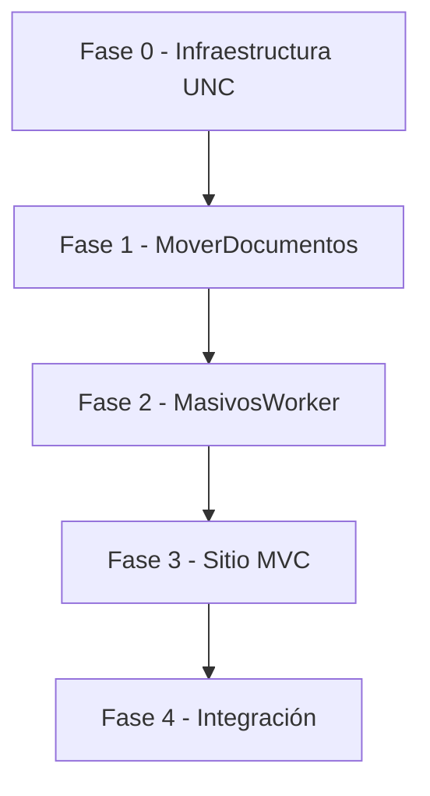

# Plan de Ejecución — Sistema Masivos v3

> **Basado en:** [Manual_Usuario_Worker_Masivo_v3.md](../Manual/Manual_Usuario_Worker_Masivo_v3.md)  
> **Fecha:** 2026-06-02  
> **Orden de implementación:** Worker 1 → adaptar Worker 2 → Portal MVC  
> **Estado general:** Worker 2 operativo en local; Worker 1 y MVC por crear

---

## Aclaración: qué proyecto es cada Worker

| Worker del manual v3 | Carpeta en el repo | Estado |
|----------------------|-------------------|--------|
| **Worker 1** — Recepción y movimiento desde `C:\scaneo` | `MoverDocumentos/` | **Por crear** (proyecto nuevo) |
| **Worker 2** — Procesamiento (barcode + APIs + contingencias) | **`MasivosWorker/`** | **Ya creado y funcionando** en producción/local |
| **Portal MVC** — Consulta y reproceso manual | `SitioVisualArchivosNoProcesados/` | **Por crear** (proyecto nuevo) |

> **`MasivosWorker` es el Worker 2 del sistema.** No se crea un segundo worker de procesamiento: se **adapta** el código existente a la nueva arquitectura (UNC, lotes TXT, carpetas `procesaria`/`noprocesados`, OpenAI, etc.).

---

## Resumen ejecutivo

| Fase | Proyecto | Carpeta | Tipo de trabajo | Entregable principal |
|------|----------|---------|-----------------|----------------------|
| **0** | Infraestructura compartida | Red + repo | Configuración | UNC operativa, carpetas base, `usuarios.txt` |
| **1** | Worker 1 | `MoverDocumentos/` | **Crear** | Servicio Windows en PC de escaneo: `C:\scaneo` → red + TXT lote |
| **2** | Worker 2 | **`MasivosWorker/`** | **Adaptar** | Mismo servicio `MasivosWorker`, evolucionado a lotes UNC + flujo v3 |
| **3** | Portal MVC | `SitioVisualArchivosNoProcesados/` | **Crear** | Web .NET 10: login, dashboard, reproceso manual |
| **4** | Integración y despliegue | Todo el repo | Validación | Prueba punta a punta y puesta en producción |



**Dependencia crítica:** La **adaptación** de Worker 2 (`MasivosWorker`) a UNC/lotes no reemplaza el núcleo actual: se extiende. Las pruebas E2E en red requieren que Worker 1 genere carpetas y `.txt` en `ArchivosNuevos`. El MVC depende de `noprocesados` y logs que produce Worker 2 ya adaptado.

**Mientras tanto (desarrollo Worker 2):** se puede probar `MasivosWorker` apuntando rutas UNC manualmente o con TXT de prueba, sin esperar a Worker 1 en producción.

---

## Convenciones del plan

| Símbolo | Significado |
|---------|-------------|
| ✅ | Completado |
| 🔄 | En progreso |
| ⏳ | Pendiente |
| 🔴 | Bloqueante / crítico |
| 🟡 | Importante |
| 🟢 | Deseable / posterior |

Cada tarea incluye:

- **ID** único (`W1-`, `W2-`, `MVC-`, `INF-`)
- **Referencia manual** (sección del v3)
- **Criterios de aceptación** verificables

---

# Fase 0 — Infraestructura compartida (prerrequisito)

> Debe completarse **antes** de Fase 1. Puede ejecutarse en paralelo con el scaffold del proyecto Worker 1.

| ID | Tarea | Prioridad | Estado |
|----|-------|-----------|--------|
| INF-01 | Validar acceso a `\\192.168.0.69\ArchivosScaneados` desde PCs de escaneo y servidor de Worker 2 | 🔴 | ⏳ |
| INF-02 | Crear cuenta de servicio / credenciales de red (`escaneados`) y documentar en configuración segura (no en código) | 🔴 | ⏳ |
| INF-03 | Crear en la raíz UNC: `Usuarios\`, `ArchivosNuevos\` | 🔴 | ⏳ |
| INF-04 | Crear `Usuarios\usuarios.txt` vacío o con usuarios piloto | 🔴 | ⏳ |
| INF-05 | Definir permisos NTFS: escritura Worker 1, lectura/escritura Worker 2, lectura MVC | 🔴 | ⏳ |
| INF-06 | Acordar con negocio el **criterio de cierre de lote** para Worker 1 (ventana de inactividad vs horario fijo) | 🟡 | ⏳ |

**Criterios de aceptación Fase 0:**

- [ ] Un usuario de prueba puede crear y borrar un archivo de prueba en `ArchivosNuevos`.
- [ ] `usuarios.txt` es legible y editable con el usuario de servicio.
- [ ] Documento interno con credenciales y rutas para `appsettings` de cada entorno.

**Referencia manual:** §4 (Estructura de almacenamiento compartido)

---

# Fase 1 — Worker 1 (`MoverDocumentos`)

> **Plan detallado:** [Individual/CreacionWorker1.md](Individual/CreacionWorker1.md) — requerimientos RF-01…RF-09, tareas, pruebas y DoD.

**Proyecto nuevo:** `MoverDocumentos/`  
**Tipo:** Servicio Windows (.NET Worker / `Microsoft.Extensions.Hosting.WindowsServices`)  
**Instalación:** Cada PC donde se escanea (cliente).

## 1.1 Scaffold y configuración

| ID | Tarea | Prioridad | Estado | Depende de |
|----|-------|-----------|--------|------------|
| W1-01 | Crear solución `MoverDocumentos.sln` y proyecto host `MoverDocumentos` | 🔴 | ⏳ | — |
| W1-02 | Registrar como Windows Service (`AddWindowsService`, nombre `MoverDocumentos`) | 🔴 | ⏳ | W1-01 |
| W1-03 | Crear `appsettings.json` con secciones: `Rutas`, `Red`, `Lote`, `Reintentos` | 🔴 | ⏳ | W1-01 |
| W1-04 | Modelos de configuración: `RutasSettings` (`CarpetaLocal`, `RaizUnc`), `RedSettings` (usuario/clave o uso de cuenta de servicio), `LoteSettings` (`SegundosInactividad` o similar) | 🔴 | ⏳ | W1-03 |
| W1-05 | Logging a Visor de eventos + consola en desarrollo | 🔴 | ⏳ | W1-01 |

**Valores iniciales sugeridos (`appsettings.json`):**

```json
{
  "Rutas": {
    "CarpetaLocal": "C:\\scaneo",
    "RaizUnc": "\\\\192.168.0.69\\ArchivosScaneados",
    "CarpetaArchivosNuevos": "ArchivosNuevos",
    "CarpetaUsuarios": "Usuarios",
    "ArchivoUsuarios": "usuarios.txt"
  },
  "Lote": {
    "SegundosInactividadParaCerrarLote": 60
  },
  "Reintentos": {
    "IntervaloSegundosRed": 30,
    "MaxIntentos": 0
  }
}
```

**Referencia manual:** §5.1, §2

---

## 1.2 Detección de usuario y registro

| ID | Tarea | Prioridad | Estado | Depende de |
|----|-------|-----------|--------|------------|
| W1-10 | Implementar `UsuarioService`: obtener UPN/correo del usuario de Windows (`UserPrincipalName` o `WindowsIdentity`) | 🔴 | ⏳ | W1-01 |
| W1-11 | Normalizar: minúsculas, texto antes de `@`, sin alterar puntos | 🔴 | ⏳ | W1-10 |
| W1-12 | Implementar `RegistroUsuarioService`: leer/escribir `usuarios.txt` con bloqueo de archivo | 🔴 | ⏳ | INF-04, W1-11 |
| W1-13 | Cache en memoria `UsuarioRegistrado` tras primer registro exitoso en la sesión del servicio | 🟡 | ⏳ | W1-12 |
| W1-14 | Tests unitarios: normalización de correos (casos del manual §5.2) | 🟡 | ⏳ | W1-11 |

**Criterios de aceptación:**

- [ ] `Alejandro.Ortiz@zentria.com.co` → `alejandro.ortiz`
- [ ] `alejandro.ortiz.gaviria@zentria.com.co` → `alejandro.ortiz.gaviria`
- [ ] Usuario nuevo se agrega una sola línea a `usuarios.txt`
- [ ] Usuario existente no duplica línea

**Referencia manual:** §5.2, §5.3

---

## 1.3 Carpetas locales y en red

| ID | Tarea | Prioridad | Estado | Depende de |
|----|-------|-----------|--------|------------|
| W1-20 | Al iniciar: crear `C:\scaneo` si no existe | 🔴 | ⏳ | W1-03 |
| W1-21 | Implementar `EstructuraCarpetasService`: crear `{RaizUnc}\{usuario}\{fecha}` y subcarpetas en minúsculas: `procesar`, `procesando`, `procesaria`, `noprocesados`, `procesados`, `error`, `log` | 🔴 | ⏳ | W1-11, INF-03 |
| W1-22 | Fecha del sistema en formato `yyyy-MM-dd` (invariant culture) | 🔴 | ⏳ | W1-21 |
| W1-23 | Tests: verificar nombres de carpetas siempre en minúsculas | 🟡 | ⏳ | W1-21 |

**Referencia manual:** §5.1, §5.5, §4.2

---

## 1.4 Watcher y movimiento de PDFs

| ID | Tarea | Prioridad | Estado | Depende de |
|----|-------|-----------|--------|------------|
| W1-30 | `FileSystemWatcher` en `C:\scaneo`, filtro `*.pdf`, eventos Created/Changed/Renamed | 🔴 | ⏳ | W1-20 |
| W1-31 | Espera de archivo estable (mismo patrón que MasivosWorker: tamaño estable N lecturas) | 🔴 | ⏳ | W1-30 |
| W1-32 | `MoverArchivoService`: **mover** (no copiar) de `C:\scaneo` → `{usuario}\{fecha}\procesar` | 🔴 | ⏳ | W1-21 |
| W1-33 | Resolución de duplicados: `archivo.pdf`, `archivo(1).pdf`, `archivo(2).pdf` — nunca sobrescribir | 🔴 | ⏳ | W1-32 |
| W1-34 | Escaneo periódico de respaldo (cada 30 s) por si el watcher pierde eventos | 🟡 | ⏳ | W1-30 |
| W1-35 | Tests de integración con carpetas temporales locales simulando UNC | 🟡 | ⏳ | W1-32, W1-33 |

**Referencia manual:** §5.4, §5.6, §5.7

---

## 1.5 Generación de TXT de lote

| ID | Tarea | Prioridad | Estado | Depende de |
|----|-------|-----------|--------|------------|
| W1-40 | Implementar `LoteService`: acumular movimientos en lote abierto por `{usuario}+{fecha}` | 🔴 | ⏳ | W1-32 |
| W1-41 | Cerrar lote tras `SegundosInactividadParaCerrarLote` sin nuevos PDF (definido en INF-06) | 🔴 | ⏳ | W1-40, INF-06 |
| W1-42 | Al cerrar: escribir TXT en `{RaizUnc}\ArchivosNuevos\{usuario}-{fecha}-{hora}.txt` | 🔴 | ⏳ | W1-41 |
| W1-43 | Contenido del TXT: una línea con ruta absoluta a `...\procesar` | 🔴 | ⏳ | W1-42 |
| W1-44 | Evitar TXT duplicado si la ruta de `procesar` no cambió y el lote ya fue notificado | 🟡 | ⏳ | W1-42 |
| W1-45 | Test: tras mover 2 PDF y esperar inactividad, existe exactamente 1 TXT con ruta correcta | 🔴 | ⏳ | W1-43 |

**Referencia manual:** §5.8

---

## 1.6 Resiliencia ante caída de red

| ID | Tarea | Prioridad | Estado | Depende de |
|----|-------|-----------|--------|------------|
| W1-50 | `RedDisponibleService`: comprobar acceso a `RaizUnc` antes de mover | 🔴 | ⏳ | INF-01 |
| W1-51 | Si red caída: log Error en Visor de eventos, **no mover**, PDF permanece en `C:\scaneo` | 🔴 | ⏳ | W1-50 |
| W1-52 | Timer de reintento: reprocesar PDFs pendientes en `C:\scaneo` cuando red vuelva | 🔴 | ⏳ | W1-51 |
| W1-53 | Test: simular UNC inaccesible → archivos permanecen local → UNC accesible → se mueven | 🔴 | ⏳ | W1-52 |

**Referencia manual:** §5.9

---

## 1.7 Instalación y validación Fase 1

| ID | Tarea | Prioridad | Estado | Depende de |
|----|-------|-----------|--------|------------|
| W1-60 | Script/documento de instalación del servicio (`sc create` o `New-Service`) | 🟡 | ⏳ | W1-02 |
| W1-61 | Prueba en 1 PC piloto: escanear 5 PDF → aparecen en UNC `procesar` + TXT en `ArchivosNuevos` | 🔴 | ⏳ | W1-45, W1-53 |
| W1-62 | Prueba duplicado de nombre y recuperación tras desconectar red | 🔴 | ⏳ | W1-61 |
| W1-63 | Actualizar manual v3 §9: Worker 1 → ✅ | 🟢 | ⏳ | W1-61 |

### Entregable Fase 1

Servicio **MoverDocumentos** instalado en PC piloto que:

1. Crea `C:\scaneo`.
2. Registra usuario en `usuarios.txt`.
3. Mueve PDFs a la estructura UNC del día.
4. Genera TXT de lote en `ArchivosNuevos`.
5. No pierde archivos si la red falla.

**Estimación:** 8–12 días hábiles (1 desarrollador).

---

# Fase 2 — Worker 2: adaptar `MasivosWorker` (ya existente)

**Proyecto = Worker 2:** `MasivosWorker/`  
**Servicio Windows actual:** `MasivosWorker` (registrado con `AddWindowsService`)  
**Enfoque:** **Adaptación incremental** — no reescribir el worker. Conservar y extender lo que ya funciona.

### Línea base ya implementada (no volver a construir)

| Componente | Ubicación | Estado |
|------------|-----------|--------|
| Host y servicio Windows | `MasivosWorker/MasivosWorker/Program.cs`, `Worker.cs` | ✅ |
| Watcher y flujo por archivo | `Infrastructure/FileWatcherInfraestructure.cs` | ✅ |
| Movimiento entre carpetas | `Infrastructure/FileManagerInfraestructure.cs` | ✅ |
| Lectura barcode (solo página 1) | `Services/BarcodeRegionService.cs` | ✅ |
| Endpoint 1 — DatosSoportes | `Services/SoporteApiService.cs` | ✅ |
| Endpoint 2 — Soporte físico + PDF | `Services/SoporteFisicoApiService.cs` | ✅ |
| Flujo unificado Worker + MVC | `Services/SoporteProcesamientoService.cs` | ✅ |
| Registro DI compartido | `Services/SoporteServiceCollectionExtensions.cs` | ✅ |
| Reintentos de lectura barcode | `ProcesarConReintentos` en FileWatcher | ✅ |
| Configuración y licencia IronBarcode | `appsettings.json`, `IronBarcodeLicenseInitializer` | ✅ |
| Rutas locales `C:\Masivos\...` | `RutasSettings` en appsettings | ✅ (modo actual) |

**Flujo actual que se mantiene como núcleo:**

```text
PDF en procesar → procesando → barcode (pág. 1) → API DatosSoportes → API físico → procesados
                                                      ↓ fallo          ↓ fallo
                                                    error            error
```

### Gap respecto al manual v3 (lo que adapta esta fase)

| Gap | Acción en MasivosWorker |
|-----|-------------------------|
| Escucha `C:\Masivos\procesar` fija | Añadir watcher de `ArchivosNuevos\*.txt` y rutas dinámicas por lote |
| Un archivo a la vez desde carpeta global | Orquestar lotes de N PDF según ruta del TXT |
| Solo carpetas `procesar/procesando/error/procesados` | Usar también `procesaria`, `noprocesados`, `log` |
| Fallos API → `error` | Fallos API → `noprocesados`; reintentos `error` → `procesaria` |
| Sin OpenAI | Nuevo `OpenAiBarcodeService` + intento 3 |
| Sin log diario acumulativo | Nuevo `LogDiarioService` |
| Sin limpieza post-lote | Borrar archivos temporales al cerrar lote |
| Sin correo por fallo OpenAI | Nuevo `EmailNotificationService` |

> Detalle histórico del código actual: `MasivosWorker/.github/PlanesEjecucion/PlanEjecucion.md`

---

## 2.0 Inventario de adaptación (antes de codificar)

| ID | Tarea | Prioridad | Estado |
|----|-------|-----------|--------|
| W2-00 | Documentar diff: comportamiento actual vs manual v3 §6 (checklist para QA) | 🟡 | ⏳ |
| W2-00b | Definir flag `ModoOperacion`: `Legacy` (C:\Masivos) \| `Red` (ArchivosNuevos) para transición sin downtime | 🔴 | ⏳ |

---

## 2.1 Configuración y rutas dinámicas

| ID | Tarea | Prioridad | Estado | Depende de |
|----|-------|-----------|--------|------------|
| W2-01 | Extender `RutasSettings`: `RaizUnc`, `ArchivosNuevos`, subcarpetas relativas (`procesar`, `procesando`, etc.) | 🔴 | ⏳ | Fase 1 validada |
| W2-02 | Eliminar dependencia fija de `C:\Masivos` en `appsettings` de producción | 🔴 | ⏳ | W2-01 |
| W2-03 | Helper `RutasLoteResolver`: dado path de `procesar` del TXT, derivar rutas hermanas (`procesando`, `error`, …) | 🔴 | ⏳ | W2-01 |
| W2-04 | Mantener `appsettings.Development.json` con rutas locales para desarrollo sin UNC | 🟡 | ⏳ | W2-02 |

**Referencia manual:** §6.1–§6.3, §3.4

---

## 2.2 Orquestador de lotes (TXT)

| ID | Tarea | Prioridad | Estado | Depende de |
|----|-------|-----------|--------|------------|
| W2-10 | Nuevo `LoteWatcherInfrastructure`: watcher en `{RaizUnc}\ArchivosNuevos\*.txt` (convive con `FileWatcherInfraestructure` vía `ModoOperacion`) | 🔴 | ⏳ | W2-00b |
| W2-11 | Cola secuencial: un TXT a la vez (`SemaphoreSlim(1)` o canal único) | 🔴 | ⏳ | W2-10 |
| W2-12 | Leer línea del TXT → validar que carpeta `procesar` existe | 🔴 | ⏳ | W2-10 |
| W2-13 | Al finalizar lote: eliminar TXT procesado | 🔴 | ⏳ | W2-10 |
| W2-14 | Desactivar o condicionar watcher antiguo en `C:\Masivos\procesar` (flag `ModoLegacy`) | 🟡 | ⏳ | W2-10 |

**Referencia manual:** §6.1, §6.2, §6.3, §6.15

---

## 2.3 Procesamiento por lotes de N archivos

| ID | Tarea | Prioridad | Estado | Depende de |
|----|-------|-----------|--------|------------|
| W2-20 | Parametro `TamanoLote` en `FileSettings` (default: 3) | 🔴 | ⏳ | W2-03 |
| W2-21 | `ProcesarLoteAsync`: tomar hasta N PDF de `procesar` → mover a `procesando` | 🔴 | ⏳ | W2-12 |
| W2-22 | Por cada PDF en `procesando`: **extraer** método de procesamiento desde `FileWatcherInfraestructure.ProcesarArchivoAsync` y reutilizarlo sin duplicar lógica | 🔴 | ⏳ | W2-21 |
| W2-23 | Repetir hasta vaciar `procesar` del lote actual | 🔴 | ⏳ | W2-21 |
| W2-24 | **Extender** `FileManagerInfraestructure`: sobrecargas o contexto de lote con rutas absolutas (mantener compatibilidad modo `Legacy`) | 🔴 | ⏳ | W2-03 |

**Referencia manual:** §6.4, §6.5

---

## 2.4 Carpetas de reintento y destinos

| ID | Tarea | Prioridad | Estado | Depende de |
|----|-------|-----------|--------|------------|
| W2-30 | **Intento 1** (`procesando`): OK → `procesados`; fallo barcode → `error` (ajustar ramas actuales de `MoverAError`) | 🔴 | ⏳ | W2-22 |
| W2-31 | **Intento 2** (`error`): reprocesar archivos pendientes; OK → `procesados`; fallo → `procesaria` (nuevo; hoy todo queda en `error`) | 🔴 | ⏳ | W2-30 |
| W2-32 | PDF corrupto: directo a `noprocesados` (hoy va a `error`) | 🔴 | ⏳ | W2-22 |
| W2-33 | Fallo endpoint 1 o 2: directo a `noprocesados` (hoy va a `error`; cambio de regla v3) | 🔴 | ⏳ | W2-22 |
| W2-34 | Evaluar si prefijo `KeyName` (`CRC_900277244_`) sigue siendo necesario en UNC | 🟡 | ⏳ | Negocio |
| W2-35 | Tests de integración: simular lote con 7 PDF, `TamanoLote=3`, verificar movimientos | 🔴 | ⏳ | W2-23 |

**Referencia manual:** §6.7–§6.13

---

## 2.5 OpenAI (tercer intento)

| ID | Tarea | Prioridad | Estado | Depende de |
|----|-------|-----------|--------|------------|
| W2-40 | Obtener y versionar prompt aprobado por negocio (archivo de recursos) | 🔴 | ⏳ | Negocio |
| W2-41 | `OpenAiBarcodeService`: enviar solo imagen página 1; parsear respuesta o `NO_BARCODE` | 🔴 | ⏳ | W2-40 |
| W2-42 | Configuración: API key, modelo, timeout en `appsettings` | 🔴 | ⏳ | W2-41 |
| W2-43 | **Intento 3** (`procesaria`): si código válido → flujo APIs; si `NO_BARCODE` → `noprocesados` | 🔴 | ⏳ | W2-41 |
| W2-44 | Reintentos OpenAI: 3 intentos por archivo/lote según manual | 🔴 | ⏳ | W2-43 |
| W2-45 | Tests con mock de API OpenAI | 🟡 | ⏳ | W2-43 |

**Referencia manual:** §6.9–§6.11

---

## 2.6 Correo y notificaciones

| ID | Tarea | Prioridad | Estado | Depende de |
|----|-------|-----------|--------|------------|
| W2-50 | `EmailNotificationService` parametrizable (SMTP, remitente, destinatarios) | 🔴 | ⏳ | W2-44 |
| W2-51 | 1 correo por lote fallido OpenAI con: usuario, fecha, cantidad, ruta, mensaje error | 🔴 | ⏳ | W2-50 |
| W2-52 | Extraer usuario y fecha desde ruta UNC del lote | 🟡 | ⏳ | W2-51 |

**Referencia manual:** §6.10

---

## 2.7 Log diario acumulativo

| ID | Tarea | Prioridad | Estado | Depende de |
|----|-------|-----------|--------|------------|
| W2-60 | `LogDiarioService`: leer/escribir `{fecha}.txt` en carpeta `log` del lote | 🔴 | ⏳ | W2-22 |
| W2-61 | Formato: `CantidadProcesados:N` y `NoProcesados:M` acumulativos | 🔴 | ⏳ | W2-60 |
| W2-62 | Incrementar contadores al cerrar cada archivo/lote | 🔴 | ⏳ | W2-61 |
| W2-63 | Tests: dos lotes el mismo día suman correctamente | 🟡 | ⏳ | W2-62 |

**Referencia manual:** §6.14

---

## 2.8 Limpieza post-lote

| ID | Tarea | Prioridad | Estado | Depende de |
|----|-------|-----------|--------|------------|
| W2-70 | Al terminar lote: borrar **solo archivos** en `procesados`, `procesando`, `procesaria`, `error` | 🔴 | ⏳ | W2-23 |
| W2-71 | No eliminar carpetas ni contenido de `noprocesados` | 🔴 | ⏳ | W2-70 |
| W2-72 | Eliminar TXT del lote en `ArchivosNuevos` | 🔴 | ⏳ | W2-13 |

**Referencia manual:** §6.15

---

## 2.9 Validación Fase 2

| ID | Tarea | Prioridad | Estado | Depende de |
|----|-------|-----------|--------|------------|
| W2-80 | Prueba E2E: Worker 1 genera TXT → Worker 2 procesa lote completo | 🔴 | ⏳ | W1-61, W2-72 |
| W2-81 | Prueba escenarios: barcode OK, error→procesaria→OpenAI OK, API falla→noprocesados | 🔴 | ⏳ | W2-80 |
| W2-82 | Verificar log diario y limpieza de carpetas temporales | 🔴 | ⏳ | W2-80 |
| W2-83 | Desplegar MasivosWorker en servidor de procesamiento | 🔴 | ⏳ | W2-80 |
| W2-84 | Actualizar manual v3 §9: Worker 2 ítems → ✅ | 🟢 | ⏳ | W2-80 |

### Entregable Fase 2

El **mismo** servicio Windows **`MasivosWorker`** (proyecto `MasivosWorker/`), en modo `Red`, procesando secuencialmente TXT de `ArchivosNuevos`, con reintentos `error`/`procesaria`, OpenAI, logs y `noprocesados` listos para el MVC. El modo `Legacy` (`C:\Masivos`) permanece disponible hasta el corte en INT-06.

**Estimación de adaptación:** 6–10 días hábiles (1 desarrollador). Menor que un greenfield porque el núcleo barcode + APIs ya está en producción.

**Conservar sin cambios funcionales (solo invocar desde el nuevo orquestador):**

- `BarcodeRegionService` — §3.3
- `SoporteApiService` — §3.1
- `SoporteFisicoApiService` — §3.2
- `ProcesarConReintentos` / validación regex del código

---

# Fase 3 — Portal MVC (`SitioVisualArchivosNoProcesados`)

**Proyecto nuevo:** `SitioVisualArchivosNoProcesados/`  
**Stack:** ASP.NET Core MVC (.NET 10)  
**Depende de:** Fase 2 generando `noprocesados` y `log\{fecha}.txt`.

## Integración obligatoria con MasivosWorker (APIs)

El MVC **no** implementa sus propias llamadas a Helpharma. Debe reutilizar el mismo stack que Worker 2:

| Capa | Proyecto / clase | Uso en MVC |
|------|------------------|------------|
| Orquestación | `Services.SoporteProcesamientoService` | `ProcesarAsync(codigoBarras, rutaPdf)` en botón **Procesar** |
| API datos | `Services.SoporteApiService` | Solo vía `SoporteProcesamientoService` |
| API física + PDF | `Services.SoporteFisicoApiService` | Solo vía `SoporteProcesamientoService` |
| DTOs | `Models.Dto.*` | `SoporteResponseDto`, `SoporteProcesamientoResult` |
| DI | `AddSoporteHelpharmaIntegracion` | Mismo registro que `MasivosWorker/Program.cs` |

**Referencias de proyecto en el `.csproj` del sitio:**

```xml
<ProjectReference Include="..\MasivosWorker\Services\Services.csproj" />
<ProjectReference Include="..\MasivosWorker\Models\Models.csproj" />
```

**`Program.cs` del sitio (fragmento):**

```csharp
builder.Services.AddSoporteHelpharmaIntegracion(builder.Configuration);
```

**`appsettings.json` del sitio** — misma sección que el worker:

```json
"ApiCredentials": {
  "SoporteApiKey": "...",
  "SoporteFisicoToken": "...",
  "IdUsuario": "system"
}
```

> Implementado en repo: `SoporteProcesamientoService.cs`, `SoporteServiceCollectionExtensions.cs`. Worker 2 ya lo usa desde `FileWatcherInfraestructure`.

---

## 3.1 Scaffold y acceso a archivos

| ID | Tarea | Prioridad | Estado | Depende de |
|----|-------|-----------|--------|------------|
| MVC-01 | Crear solución y proyecto MVC .NET 10 | 🔴 | ⏳ | W2-80 |
| MVC-02 | `appsettings`: `RaizUnc`, credenciales UNC + **`ApiCredentials`** (igual que MasivosWorker) | 🔴 | ⏳ | MVC-01 |
| MVC-03 | Servicio `UncFileService`: listar carpetas por usuario, leer PDF, mover archivos | 🔴 | ⏳ | MVC-02 |
| MVC-04 | Referenciar `MasivosWorker/Services` y `Models`; registrar `AddSoporteHelpharmaIntegracion` | 🔴 | ✅ (servicio listo en repo) | MVC-01 |

**Referencia manual:** §7, §3.4

---

## 3.2 Autenticación

| ID | Tarea | Prioridad | Estado | Depende de |
|----|-------|-----------|--------|------------|
| MVC-10 | Pantalla Login: solo campo usuario (sin contraseña) | 🔴 | ⏳ | MVC-01 |
| MVC-11 | `UsuarioAuthService`: validar contra `usuarios.txt` (comparación UPPERCASE) | 🔴 | ⏳ | MVC-03 |
| MVC-12 | Sesión/cookie con usuario normalizado en minúsculas | 🔴 | ⏳ | MVC-11 |
| MVC-13 | Usuario no en archivo: mensaje exacto del manual §7.2 | 🔴 | ⏳ | MVC-11 |
| MVC-14 | Tests unitarios de equivalencia `ALEJANDRO.ORTIZ` = `alejandro.ortiz` | 🟡 | ⏳ | MVC-11 |

**Referencia manual:** §7.1, §7.2

---

## 3.3 Home y dashboard

| ID | Tarea | Prioridad | Estado | Depende de |
|----|-------|-----------|--------|------------|
| MVC-20 | Home: listar fechas (`YYYY-MM-DD`) existentes bajo `{RaizUnc}\{usuario}\` | 🔴 | ⏳ | MVC-12 |
| MVC-21 | Validar existencia de carpeta antes de navegar | 🔴 | ⏳ | MVC-20 |
| MVC-22 | Dashboard: leer `log\{fecha}.txt` y mostrar `CantidadProcesados` / `NoProcesados` | 🔴 | ⏳ | MVC-20, W2-62 |
| MVC-23 | UI: calendario o lista de fechas clicables | 🟡 | ⏳ | MVC-20 |

**Referencia manual:** §7.3, §7.4

---

## 3.4 Tabla y visor PDF

| ID | Tarea | Prioridad | Estado | Depende de |
|----|-------|-----------|--------|------------|
| MVC-30 | Vista `NoProcesados`: tabla con columnas NombreArchivo, Fecha, CodigoBarras, BotonVer | 🔴 | ⏳ | MVC-20 |
| MVC-31 | Listar PDFs desde `{usuario}\{fecha}\noprocesados` | 🔴 | ⏳ | MVC-30 |
| MVC-32 | Endpoint para servir PDF (`FileStreamResult`) con autorización por sesión | 🔴 | ⏳ | MVC-31 |
| MVC-33 | Panel derecho: visor PDF (PDF.js o similar) con zoom, scroll, navegación páginas | 🔴 | ⏳ | MVC-32 |
| MVC-34 | Campo texto código de barras + botón **Procesar** | 🔴 | ⏳ | MVC-30 |

**Referencia manual:** §7.5, §7.6, §7.7

---

## 3.5 Reproceso manual

| ID | Tarea | Prioridad | Estado | Depende de |
|----|-------|-----------|--------|------------|
| MVC-40 | Inyectar `SoporteProcesamientoService` en controlador; en **Procesar** llamar `ProcesarAsync(codigo, rutaPdf)` — **no** llamar APIs directamente | 🔴 | ⏳ | MVC-04 |
| MVC-41 | Si `resultado.EsExitoso`: mover PDF `noprocesados` → `procesados`, actualizar log, quitar de tabla | 🔴 | ⏳ | MVC-40, W2-62 |
| MVC-42 | Si `FalloApiDatos` o `FalloApiFisico`: mensaje §7.9, archivo en `noprocesados` | 🔴 | ⏳ | MVC-40 |
| MVC-43 | Bloqueo de doble submit / reproceso duplicado (token o flag en sesión) | 🟡 | ⏳ | MVC-41 |
| MVC-44 | Tests integración con APIs mock | 🟡 | ⏳ | MVC-40 |

**Referencia manual:** §7.7, §7.8, §7.9

---

## 3.6 Despliegue y validación Fase 3

| ID | Tarea | Prioridad | Estado | Depende de |
|----|-------|-----------|--------|------------|
| MVC-50 | Publicar en IIS o Kestrel detrás de reverse proxy interno | 🔴 | ⏳ | MVC-44 |
| MVC-51 | Prueba E2E con usuario piloto: login → fecha → ver PDF → reproceso exitoso | 🔴 | ⏳ | MVC-50 |
| MVC-52 | Prueba reproceso fallido muestra mensaje y no mueve archivo | 🔴 | ⏳ | MVC-50 |
| MVC-53 | Actualizar manual v3 §9: Portal MVC → ✅ | 🟢 | ⏳ | MVC-51 |

### Entregable Fase 3

Portal web operativo para consulta y corrección manual de `noprocesados`.

**Estimación:** 10–14 días hábiles (1 desarrollador).

---

# Fase 4 — Integración, pruebas y despliegue

| ID | Tarea | Prioridad | Estado | Depende de |
|----|-------|-----------|--------|------------|
| INT-01 | Matriz de pruebas E2E documentada (ver tabla abajo) | 🔴 | ⏳ | Fase 3 |
| INT-02 | Piloto con 2 usuarios reales y volumen bajo (10–20 PDF/día) | 🔴 | ⏳ | INT-01 |
| INT-03 | Monitoreo: Visor de eventos Worker 1 y 2 + revisión logs diarios | 🟡 | ⏳ | INT-02 |
| INT-04 | Capacitación operativa (manual v3 §8) | 🟡 | ⏳ | INT-02 |
| INT-05 | Rollout gradual: más PCs con MoverDocumentos | 🟡 | ⏳ | INT-02 |
| INT-06 | Retirar modo legacy `C:\Masivos` cuando todo el tráfico use UNC | 🟢 | ⏳ | INT-05 |

## Matriz de pruebas E2E

| # | Escenario | Worker 1 | Worker 2 | MVC | Resultado esperado |
|---|-----------|----------|----------|-----|-------------------|
| 1 | Escaneo normal 5 PDF | Mueve a `procesar`, genera TXT | Procesa todo a APIs → limpia `procesados` | — | Log incrementa procesados |
| 2 | Red caída durante escaneo | PDF en `C:\scaneo` | — | — | Al volver red, se mueven |
| 3 | Barcode ilegible | — | `error` → `procesaria` → `noprocesados` | Usuario corrige manual | En `procesados` tras MVC |
| 4 | API caída | — | Va a `noprocesados` | Reintento manual falla | Mensaje §7.9 |
| 5 | OpenAI timeout | — | Correo + `noprocesados` | — | Correo recibido |
| 6 | Usuario no registrado | — | — | Login rechazado | Mensaje §7.2 |
| 7 | Duplicado nombre PDF | Renombra `(1)` | Procesa ambos | — | Sin sobrescritura |

---

# Cronograma sugerido (referencia)

| Fase | Duración estimada | Acumulado |
|------|-------------------|-----------|
| Fase 0 — Infraestructura | 2–3 días | 3 días |
| Fase 1 — Worker 1 | 8–12 días | 15 días |
| Fase 2 — Adaptar MasivosWorker (Worker 2) | 6–10 días | 25 días |
| Fase 3 — Portal MVC | 10–14 días | 39 días |
| Fase 4 — Integración | 5–7 días | **~46 días hábiles** |

> **Paralelismo posible:** tras INF-03, un desarrollador puede **adaptar MasivosWorker** (W2) en paralelo con **crear MoverDocumentos** (W1), porque el núcleo de W2 ya existe y solo necesita TXT/carpetas de prueba manuales hasta W1-61.

---

# Riesgos y mitigaciones

| Riesgo | Impacto | Mitigación |
|--------|---------|------------|
| Criterio de lote Worker 1 no definido | Bloquea W1-41 | Resolver INF-06 en kickoff |
| Permisos UNC incorrectos | Alto | Piloto INF-01 antes de W1-61 |
| Prompt OpenAI no aprobado | Bloquea W2-40 | Gestión con negocio en semana 1 Fase 2 |
| Servicios API duplicados en MVC | Duplicación de bugs | Usar solo `SoporteProcesamientoService` (ya en `MasivosWorker/Services`) |
| Prefijo `CRC_900277244_` incompatible con nombres de escáner | Medio | Decidir en W2-34 antes de producción |
| `idUsuario` fijo `"system"` | Bajo | Parametrizar por usuario de sesión en MVC (W2 negocio) |

---

# Definición de terminado (DoD) del sistema completo

- [ ] Worker 1 instalado en todos los PCs de escaneo configurados a `C:\scaneo`.
- [ ] **MasivosWorker** (Worker 2) en modo `Red` procesa lotes desde `ArchivosNuevos` sin intervención manual.
- [ ] Portal MVC accesible para usuarios en `usuarios.txt`.
- [ ] Documentos en `noprocesados` pueden reprocesarse manualmente.
- [ ] Logs diarios reflejan contadores reales.
- [ ] Manual v3 §9 actualizado con todos los componentes en ✅.
- [ ] Matriz INT-01 ejecutada sin defectos críticos abiertos.

---

# Referencias

| Documento | Ubicación |
|-----------|-----------|
| Manual de especificación v3 | `Manual/Manual_Usuario_Worker_Masivo_v3.md` |
| **Worker 2 — código en producción** | `MasivosWorker/` (servicio Windows `MasivosWorker`) |
| Plan de gaps del worker actual (prefijos, etc.) | `MasivosWorker/.github/PlanesEjecucion/PlanEjecucion.md` |
| Diagrama de flujo | `PlanesEjecucion/diagrama-flujo-worker-masivos.html` |

---

*Fin del plan de ejecución.*
